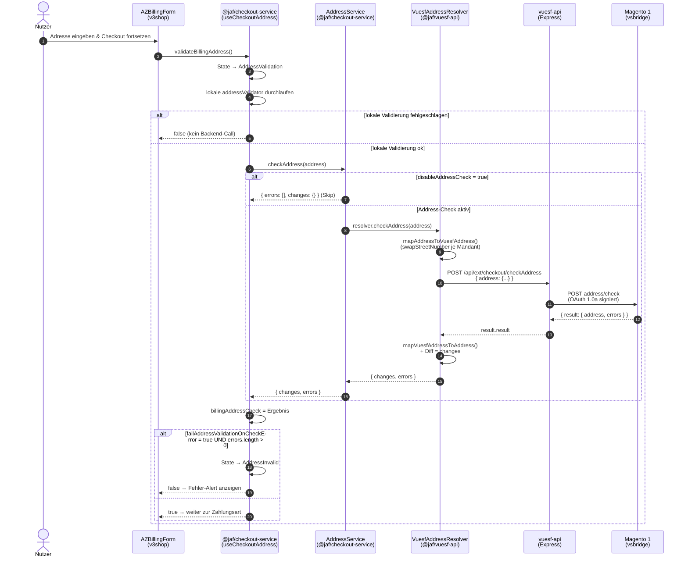
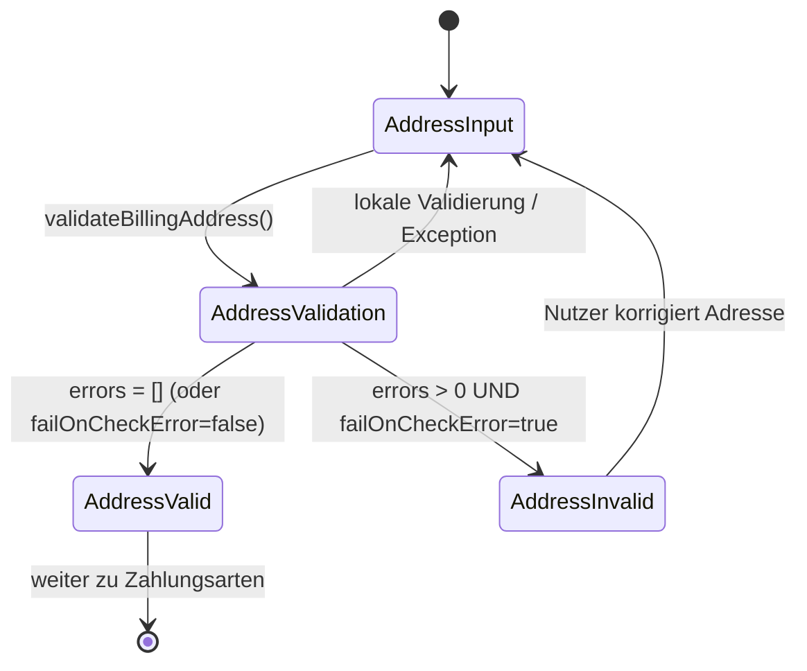
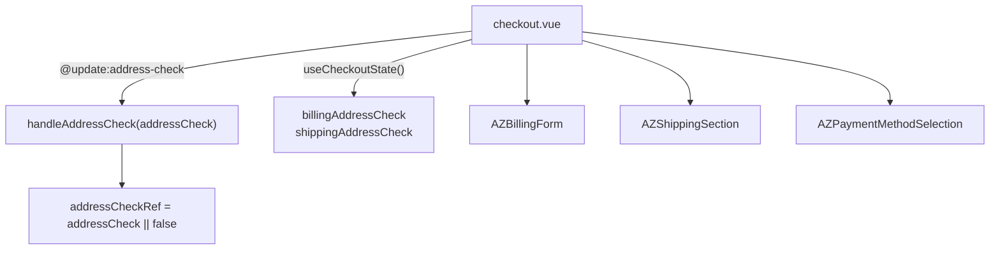

# Address-Check im Checkout

> Adressvalidierung während des Checkout-Prozesses im v3shop.
> Stand: 2026-06-16 · Branch `develop`

Dieses Dokument beschreibt die **Adressprüfung (Address-Check)** im Checkout: welche Systeme beteiligt sind, wie sie miteinander kommunizieren, wie der Datenfluss aussieht und wie das Verhalten pro Mandant konfiguriert wird.

Jede Aussage ist mit Datei + Zeile belegt. Aussagen, die nicht direkt aus gelesenem Code ableitbar sind, sind als ⚠️ **Vermutung** markiert.

---

## 1. Überblick: Beteiligte Systeme

| System | Rolle beim Address-Check | Technologie |
|--------|--------------------------|-------------|
| **v3shop** (Frontend) | Erfasst die Adresse im Checkout, triggert die Prüfung, zeigt Fehler an, blockiert ggf. den Fortschritt | Nuxt 3 / Vue 3 (SSR) |
| **@jaf/checkout-service** | Orchestriert den Checkout-State (State Machine), ruft den Address-Service auf | Internes Package (`@jaf/*`) |
| **@jaf/vuesf-api** (Resolver) | Mappt die Adresse, baut den HTTP-Request, ruft die vuesf-api auf, mappt die Antwort zurück | Internes Package (`@jaf/*`) |
| **vuesf-api** (Backend) | Express-Proxy: nimmt den Request entgegen, signiert ihn (OAuth 1.0a) und reicht ihn an Magento weiter | Express (Node.js) |
| **Magento 1** (vsbridge) | Führt die eigentliche Adressprüfung durch | Magento 1 REST (`/vsbridge`) |
| Externer Adressdienst | Eigentliche Prüf-Logik hinter Magento | ⚠️ Vermutung: Deutsche Post Direkt AdressFactory (siehe §7) |

> **DOP ist NICHT beteiligt.** Eine Suche nach `checkAddress` / `addressCheck` / `address-check` in `/projects/dop/src` ergab **keine Treffer**. Der Address-Check ist ausschließlich Teil des v3shop-Checkouts. DOP (Produktdetailseite) hat keinen Bezug zur Adressvalidierung.

---

## 2. System-Kontext (welche Systeme kommunizieren)

```mermaid
flowchart LR
    subgraph Browser["🌐 Browser (Client)"]
        V3["v3shop\nCheckout-Page\n+ AZBillingForm"]
    end

    subgraph JAF["📦 Interne @jaf Packages (laufen im v3shop-Bundle)"]
        CS["@jaf/checkout-service\nState Machine"]
        RES["@jaf/vuesf-api\nVuesfAddressResolver"]
    end

    subgraph Backend["🖥️ vuesf-api (Express)"]
        EXT["POST /ext/checkout/checkAddress"]
    end

    subgraph Magento["🏬 Magento 1 (vsbridge)"]
        MAG["POST address/check"]
    end

    EXTSVC["📮 Externer Adressdienst\n(⚠️ vermutet: Dt. Post AdressFactory)"]

    V3 -->|"@update:address-check"| CS
    CS -->|"checkAddress(address)"| RES
    RES -->|"HTTPS POST\n/api/ext/checkout/checkAddress"| EXT
    EXT -->|"OAuth 1.0a signiert\nREST POST"| MAG
    MAG -.->|"⚠️ vermutet"| EXTSVC
    EXTSVC -.-> MAG
    MAG -->|"result.result"| EXT
    EXT -->|"{ address, errors }"| RES
    RES -->|"{ changes, errors }"| CS
    CS -->|"billingAddressCheck"| V3
```



**Kommunikationspfade (belegt):**

1. **v3shop ↔ @jaf-Packages**: In-Process. Die Packages werden in das v3shop-Bundle kompiliert; es ist kein Netzwerk-Hop.
2. **@jaf/vuesf-api → vuesf-api**: HTTPS-Request an die vuesf-api Base-URL + `/api/ext/checkout/checkAddress`
   ([address.js:80](../../library) im `@jaf/vuesf-api`-Build).
3. **vuesf-api → Magento 1**: OAuth-1.0a-signierter REST-POST auf die Magento-Resource `address/check`
   ([checkout/index.ts:73-79](../../vuesf-api/src/api/extensions/checkout/index.ts#L73-L79)).
4. **Magento → externer Dienst**: ⚠️ Vermutung (nicht im gelesenen Code, aber durch das Fehlercode-Schema stark indiziert — siehe §7).

> **Wichtig — Client- vs. Server-URL der vuesf-api:**
> Die vuesf-api hat je nach Environment eine getrennte Client- und Server-Base-URL
> ([nuxt.vuesf-api.config.ts:4-19](../../v3shop/config/nuxt.vuesf-api.config.ts#L4-L19)).
> Da der Address-Check durch eine Nutzer-Interaktion im Browser ausgelöst wird, läuft er über die **Client-URL**:
>
> | Environment | Client-Base-URL (Browser) | Server-Base-URL (SSR, intern) |
> |-------------|---------------------------|-------------------------------|
> | develop     | `https://vuesf-api-dev.dstest.mdm.de` | `https://vuesf-api-dev.dstest.mdm.de` |
> | release     | `https://vuesf-api-rc.dstest.mdm.de`  | `http://rc_jaf_vuesf_api_app:8080` |
> | production  | `https://vuesf-api.mdm.de`            | `http://prod_jaf_vuesf_api_app:8080` |

---

## 3. Ablauf (Sequenzdiagramm)



**Belege zum Sequenzablauf:**

- `validateBillingAddress()` → State `AddressValidation`, Fehlerzustand `AddressInvalid`, Fallback-State `AddressInput`:
  [useCheckoutAddress.ts:108-115](../../library).
- Lokale `addressValidator` werden **vor** dem Backend-Call durchlaufen; schlägt einer fehl, wird ohne Backend-Call `false` zurückgegeben:
  [useCheckoutAddress.ts:118-124](../../library).
- `AddressService.checkAddress()` überspringt bei `disableAddressCheck=true` den Resolver und liefert `{ errors: [], changes: {} }`:
  belegt im `@jaf/checkout-service`-Build (`lib.js`, Klasse `AddressService`).
- Erfolgs-Bedingung: `!failAddressValidationOnCheckError || errors.length === 0`:
  [useCheckoutAddress.ts:132-133](../../library) (billing) bzw. :177-178 (shipping).
- Fehler beim Request (Exception): Ergebnis wird auf `{ errors: [500], changes: {} }` gesetzt, Rückgabe `false`:
  [useCheckoutAddress.ts:135-140](../../library).

---

## 4. State Machine des Address-Checks

Der Address-Check ist eine Transition innerhalb der Checkout-State-Machine des `@jaf/checkout-service`.



**Belegte Status-Konstanten** (aus dem `@jaf/checkout-service`-Build, `lib.js`):

- `CHECKOUT_STATUS`: u.a. `AddressInput = "address-input"`, `AddressValid = "address-valid"`
- `CHECKOUT_PROCESS_STATUS`: u.a. `AddressValidation = "address-validation"`
- `CHECKOUT_ERROR_STATUS`: u.a. `AddressInvalid = "address-invalid"`

---

## 5. Datenfluss: Request & Response

### 5.1 Request (vom Resolver an die vuesf-api)

Der Resolver mappt das interne `IAddress`-Objekt auf das von Magento erwartete Vuesf-Format und sendet es als POST-Body
([address.js, `VuesfAddressResolver.checkAddress`](../../library)).

```jsonc
// POST {vuesf-api-baseUrl}/api/ext/checkout/checkAddress
{
  "address": {
    "salutation": "Herr",
    "firstname":  "Max",
    "lastname":   "Mustermann",
    "street":     ["Musterstraße", "12"],  // [Straße, Hausnummer]
    "postcode":   "10115",
    "city":       "Berlin",
    "country_id": "DE",
    "flatname":   ""
  }
}
```

**Feld-Mapping `IAddress` → Vuesf-Adresse** (belegt, `address.js` Mapping `p`):

| Intern (`IAddress`) | Vuesf-Feld (an Magento) |
|---------------------|-------------------------|
| `salutation`        | `prefix` / `salutation` |
| `firstName`         | `firstname`             |
| `lastName`          | `lastname`              |
| `street` + `houseNumber` | `street[]` (Array)  |
| `zipCode`           | `postcode`              |
| `city`              | `city`                  |
| `country`           | `country_id`            |
| `flatname`          | `flatname`              |

> **`swapStreetNumber` (mandantenspezifisch):** Für den Mandanten **stefm** wird die Reihenfolge im `street`-Array vertauscht (`[Hausnummer, Straße]` statt `[Straße, Hausnummer]`).
> Belegt: [nuxt.vuesf-api.config.ts:51](../../v3shop/config/nuxt.vuesf-api.config.ts#L51) (`swapStreetNumber: store === 'stefm'`) und das Mapping in `address.js`.

### 5.2 Response (von Magento zurück)

```jsonc
// { result: { address, errors } }  →  vuesf-api gibt result.result zurück
{
  "address": {
    "firstname":  "Max",
    "lastname":   "Mustermann",
    "street":     ["Musterstr.", "12"],   // ggf. vom Dienst normalisiert
    "postcode":   "10115",
    "city":       "Berlin",
    "country_id": "DE"
  },
  "errors": [23, 71]   // Fehlercodes (leer = Adresse ok)
}
```

### 5.3 Rückgabe des Resolvers an den checkout-service

Der Resolver vergleicht die zurückgegebene (ggf. korrigierte) Adresse feldweise mit der eingegebenen und liefert nur die **Abweichungen** als `changes`
(belegt, `address.js`, Diff-Schleife über `Object.getOwnPropertyNames`):

```ts
interface IAddressCheckResult {
  errors: number[];            // Fehlercodes vom Backend; [] = ok
  changes: Partial<IAddress>;  // nur die Felder, die der Dienst geändert hat
}
```

Belegt: [lib.d.ts:242-245](../../library) (`@jaf/checkout-service`).

> **Hinweis:** Das `changes`-Objekt enthält die normalisierten/korrigierten Werte. Im aktuell gelesenen v3shop-Code wird es **gespeichert** (`billingAddressCheck.changes`), aber es existiert **kein** UI-Element (z.B. Modal „Adressvorschlag übernehmen?"), das diese Vorschläge dem Nutzer aktiv zur Übernahme anbietet. Nur die `errors` lösen sichtbares Verhalten aus.

---

## 6. Einbindung im v3shop (Frontend)



**Belege (v3shop):**

- `billingAddressCheck` / `shippingAddressCheck` aus `useCheckoutState()`:
  [checkout.vue:73-79](../../v3shop/src/pages/checkout.vue#L73-L79).
- `AZBillingForm` emittiert `@update:address-check` → Handler `handleAddressCheck`:
  [checkout.vue:296](../../v3shop/src/pages/checkout.vue), Handler [checkout.vue:217-226](../../v3shop/src/pages/checkout.vue#L217-L226).

> ⚠️ **Beobachtung (Stand `develop`):** `addressCheckRef` wird in [checkout.vue](../../v3shop/src/pages/checkout.vue) zwar deklariert (Z. 217) und durch den Handler gesetzt (Z. 225), aber **nirgends weiter konsumiert** (keine `disabledByAddressCheck`-Computed, kein `invalid-address`-Prop an `AZPaymentMethodSelection` im aktuellen Branch). Die ref ist damit aktuell ohne Wirkung — vermutlich Vorbereitung für ein noch nicht aktives Feature. Das sichtbare Fehlerverhalten kommt aus dem `@jaf/checkout-service`-State (`billingAddressCheck.errors`) und den Formular-Komponenten der `@ui-library`, nicht aus `addressCheckRef`.

---

## 7. Fehlercodes des Address-Checks

Der `@jaf/checkout-service`-Build (`lib.js`) definiert ein vollständiges `ADDRESS_ERRORS`-Enum. Diese Codes entsprechen dem Schema einer **Deutsche-Post-Adressvalidierung** (PLZ-/Ort-/Postfach-/NL-spezifische Regeln, „Conspicuous Address", Frankreich-Übersee), was die ⚠️ Vermutung stützt, dass Magento intern an die **Deutsche Post Direkt AdressFactory** (o.ä.) delegiert.

| Code | Bedeutung (Auszug) |
|------|--------------------|
| `500` | HTTP-Fehler / Dienst nicht erreichbar (vom Frontend gesetzt) |
| `22` | Leere PLZ |
| `23` | Erste zwei PLZ-Ziffern passen nicht zum Ort |
| `25` | Leerer Ort |
| `27` | Keine gültige Stadt für PLZ gefunden |
| `32` | Adressdaten konnten nicht ermittelt werden |
| `40` | Auffällige Adresse (Conspicuous Address) |
| `48` / `49` | Land muss gefüllt sein / Land existiert nicht |
| `62` / `69` | Leere Hausnummer / leerer Vorname |
| `65` | Hausnummer nicht im Straßen-Bereich |
| `71` / `72` | Straße bzw. Ort nicht im PLZ-Bereich |
| `81` | Keine Zustell-PLZ (Frankreich Übersee) |
| `60`–`64` | Niederlande-spezifische PLZ-Regeln |

> Die vollständige Liste (Codes 22–76 + 81) steht im Enum `ADDRESS_ERRORS` im `@jaf/checkout-service`-Build. Ein leeres `errors`-Array bedeutet: Adresse ist gültig.

---

## 8. Mandanten-Konfiguration

Zwei Flags steuern, ob ein Adressfehler den Checkout blockiert:

| Flag | Wirkung | Quelle |
|------|---------|--------|
| `disableAddressCheck` | `true` → Address-Check wird komplett übersprungen (`{ errors: [], changes: {} }`) | [nuxt.checkout.config.ts:28](../../v3shop/config/nuxt.checkout.config.ts#L28) |
| `failAddressValidationOnCheckError` | `true` → Adressfehler (`errors > 0`) lassen die Validierung **fehlschlagen** und blockieren den Fortschritt | [nuxt.checkout.config.ts:24-25](../../v3shop/config/nuxt.checkout.config.ts#L24-L25) |

**Pro Mandant (belegt):**

| Mandant | `failAddressValidationOnCheckError` | Quelle |
|---------|-------------------------------------|--------|
| **mdm**   | `true`  | [mdm.storeConfig.ts:62](../../v3shop/config/storeConfig/mdm.storeConfig.ts#L62) |
| **borek** | `true`  | [borek.storeConfig.ts:62](../../v3shop/config/storeConfig/borek.storeConfig.ts#L62) |
| **stefm** | `true`  | [stefm.storeConfig.ts:44](../../v3shop/config/storeConfig/stefm.storeConfig.ts#L44) |
| **imm**   | nicht gesetzt → Default `false` | (kein Eintrag gefunden) |

> Default-Wert beider Flags ist `false`, wenn in der `storeConfig` nicht gesetzt
> ([nuxt.checkout.config.ts:24-28](../../v3shop/config/nuxt.checkout.config.ts#L24-L28)).
> Für **imm** wurde kein `failAddressValidationOnCheckError` gefunden — d.h. Adressfehler blockieren dort den Checkout **nicht** (Validierung gibt `true` zurück, der Fehler wird nur im State gespeichert). ⚠️ Sofern nicht an anderer Stelle überschrieben.

---

## 9. Faktenstatus

| Aussage | Status |
|---------|--------|
| v3shop triggert Address-Check via `AZBillingForm` → `useCheckoutAddress` | ✅ Belegt |
| Request geht an vuesf-api `/api/ext/checkout/checkAddress` | ✅ Belegt (`@jaf/vuesf-api` Build) |
| vuesf-api proxied per OAuth-1.0a-REST an Magento `address/check` | ✅ Belegt ([checkout/index.ts:73-79](../../vuesf-api/src/api/extensions/checkout/index.ts#L73-L79)) |
| Magento gibt `{ address, errors }` zurück; Resolver bildet `changes`-Diff | ✅ Belegt |
| `swapStreetNumber` nur für stefm | ✅ Belegt ([nuxt.vuesf-api.config.ts:51](../../v3shop/config/nuxt.vuesf-api.config.ts#L51)) |
| Blockierverhalten via `failAddressValidationOnCheckError` (mdm/borek/stefm = true) | ✅ Belegt |
| DOP ist **nicht** am Address-Check beteiligt | ✅ Belegt (Grep ohne Treffer) |
| `addressCheckRef` in checkout.vue ist aktuell ohne Wirkung | ✅ Belegt (nur Deklaration + Zuweisung, keine Verwendung) |
| Magento delegiert an Deutsche Post Direkt AdressFactory | ⚠️ Vermutung (durch Fehlercode-Schema stark indiziert, nicht im gelesenen Code bewiesen) |
| imm blockiert Checkout bei Adressfehler nicht | ⚠️ Vermutung (kein Config-Eintrag gefunden; Default `false`) |
| Interne Magento-Logik / externer Dienstvertrag | ❌ Unbekannt (nur per Magento-Backend-/DevOps-Zugriff prüfbar) |

---

## 10. Quellen (Code-Referenzen)

**v3shop**
- [src/pages/checkout.vue](../../v3shop/src/pages/checkout.vue) — Einbindung, Handler, State
- [config/nuxt.vuesf-api.config.ts](../../v3shop/config/nuxt.vuesf-api.config.ts) — Base-URLs, `swapStreetNumber`
- [config/nuxt.checkout.config.ts](../../v3shop/config/nuxt.checkout.config.ts) — `disableAddressCheck`, `failAddressValidationOnCheckError`
- [config/storeConfig/](../../v3shop/config/storeConfig/) — mandantenspezifische Flags

**vuesf-api**
- [src/api/extensions/checkout/index.ts](../../vuesf-api/src/api/extensions/checkout/index.ts) — Route `POST /ext/checkout/checkAddress`

**Interne Packages (`@jaf/*`, gelesen aus dem v3shop-`node_modules`-Build)**
- `@jaf/checkout-service` — `useCheckoutAddress.ts`, `lib.js`/`lib.d.ts` (State Machine, `AddressService`, `ADDRESS_ERRORS`)
- `@jaf/vuesf-api` — `address.js` (`VuesfAddressResolver.checkAddress`, Mappings)
- Quell-Repos: `/projects/library/packages/*`
