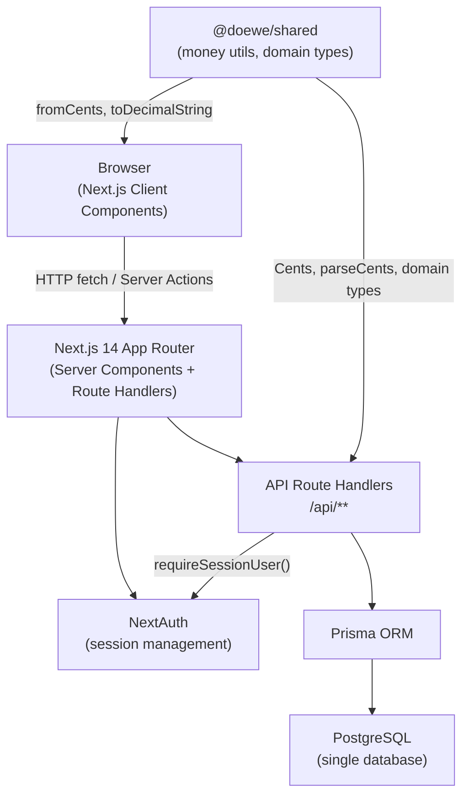
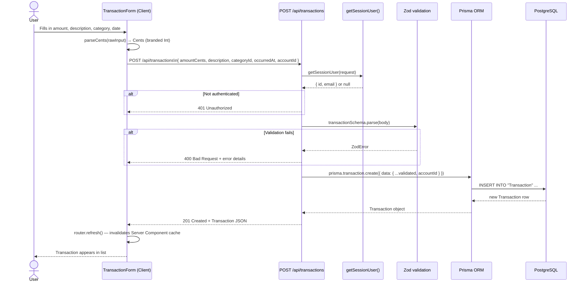

# Doewe — Architecture

## Overview

Doewe is a personal finance management application designed for individual users who want to track income and expenses, manage recurring payments, set monthly budgets per category, and plan savings goals. It runs as a web application and provides a dashboard with analytics, a transaction log, a budget overview, and a savings plan. All data is scoped strictly to the authenticated user — multiple users can share the same instance without seeing each other's data.

---

## System Architecture



The browser communicates exclusively through the Next.js layer. Server Components render the initial HTML; client-side mutations hit the REST-style API route handlers. NextAuth manages the session cookie. Prisma translates TypeScript model calls into SQL. The `@doewe/shared` package provides money arithmetic and domain types consumed by both the server (validation, creation) and the client (formatting).

---

## Monorepo Structure

```
Doewe/
├── apps/
│   └── web/                         # The Next.js application
│       ├── app/
│       │   ├── layout.tsx            # Root layout, AppChrome wrapper
│       │   ├── page.tsx              # Dashboard (/)
│       │   ├── transactions/         # /transactions page
│       │   ├── budgets/              # /budgets page
│       │   ├── saving-plan/          # /saving-plan page
│       │   ├── settings/             # /settings page
│       │   ├── login/                # /login page
│       │   └── api/
│       │       ├── auth/             # NextAuth [...nextauth] + /register
│       │       ├── transactions/     # GET, POST, PATCH [id], DELETE [id]
│       │       ├── recurring-transactions/  # CRUD + skips sub-resource
│       │       ├── budgets/          # GET, POST
│       │       ├── saving-plan/      # GET, POST, PATCH [id], DELETE [id]
│       │       ├── categories/       # GET, POST, DELETE [id]
│       │       ├── accounts/         # GET
│       │       └── analytics/
│       │           ├── summary/      # Current-month dashboard numbers
│       │           └── quarterly/    # 3-month rolling view
│       ├── components/
│       │   ├── AppChrome.tsx         # Shell: sidebar + header + content slot
│       │   ├── Header.tsx            # Top navigation bar
│       │   ├── TransactionForm.tsx   # Add/edit transaction modal
│       │   ├── RecurringTransactionForm.tsx
│       │   ├── SearchableSelect.tsx  # Accessible combobox for categories
│       │   └── ...                   # Charts, budget cards, saving widgets
│       ├── lib/
│       │   ├── auth.ts               # getSessionUser / requireSessionUser
│       │   ├── authOptions.ts        # NextAuth configuration
│       │   ├── prisma.ts             # Singleton PrismaClient
│       │   ├── config.ts             # App-wide constants
│       │   ├── i18n.ts               # Translation helper
│       │   └── locales/              # de.json (primary), en.json
│       └── prisma/
│           ├── schema.prisma         # Canonical data model
│           ├── migrations/           # Prisma migration history
│           └── seed.ts               # Demo data seeder
├── packages/
│   └── shared/
│       └── src/
│           ├── money.ts              # Cents type, arithmetic helpers
│           ├── strings.ts            # NonEmptyString, ensureNonEmpty
│           ├── domain.ts             # Transaction type, createTransaction
│           └── index.ts              # Re-exports
└── shared/
    ├── eslint/                       # Shared ESLint config baseline
    └── tsconfig/                     # Shared TypeScript config baseline
```

---

## Data Flow — User Creates a Transaction



---

## Key Architectural Decisions

### 1. Integer cents for all monetary values (`amountCents: Int`)

**Decision:** Every monetary amount is stored and passed as an integer number of cents.

**Rationale:** Floating-point arithmetic on monetary values causes rounding errors that accumulate over time (e.g., `0.1 + 0.2 !== 0.3` in IEEE 754). Using integers eliminates this class of bug entirely. The `@doewe/shared` package provides a `Cents` branded type and arithmetic helpers (`add`, `sub`, `multiply`) to make this safe at the type level. Display-only conversion (`fromCents`, `toDecimalString`) happens at the UI boundary.

### 2. Positive = income, negative = expense (sign convention)

**Decision:** A single `amountCents` field carries the sign: positive values are income, negative values are expenses.

**Rationale:** This avoids a separate `type` discriminator field and allows simple arithmetic for balance calculations: `SUM(amountCents)` gives the net position directly. Analytics endpoints sum values without branching. The trade-off is that the UI must negate the value when the user enters an expense as a positive number.

### 3. Next.js 14 App Router with server components

**Decision:** Pages are React Server Components by default; only interactive leaf components are client components.

**Rationale:** Server components reduce the JavaScript bundle shipped to the browser, allow direct async data fetching without an extra API round-trip for initial renders, and keep sensitive logic (Prisma queries, session checks) out of the client. API routes remain as thin HTTP handlers for mutations.

### 4. Prisma ORM over raw SQL or a query builder

**Decision:** Prisma is the only database access layer; no raw SQL in application code.

**Rationale:** Prisma generates TypeScript types from the schema, which means every query result is fully typed. Migrations are tracked as SQL files in version control. The schema-first approach makes the data model the single source of truth and eliminates the N+1 problems that ORMs can introduce (Prisma uses `include` for eager loading).

### 5. `@doewe/shared` as an internal package

**Decision:** Money utilities and core domain types live in a separate `packages/shared` workspace package consumed by both the `apps/web` server code and the client.

**Rationale:** Sharing code between the server (API routes, seeder) and the client (form validation, display formatting) without duplication. The package boundary also enforces that domain rules (e.g., `Cents` must be an integer, `NonEmptyString` must be non-empty) are validated once and reused everywhere.

### 6. All auth checks via `requireSessionUser()` / `getSessionUser()`

**Decision:** Every API route calls `requireSessionUser()` (throws 401 if not authenticated) at the top of the handler before any DB access.

**Rationale:** Centralizing the auth check in a single function prevents accidental omission. `requireSessionUser()` returns `{ id, email }` which is then threaded into every Prisma query as a `userId` or via an account relation check, ensuring users can only read and write their own data.

### 7. Savings identified by category name, not a dedicated model field

**Decision:** A category is treated as a savings category when its name matches "savings" or "sparen" (case-insensitive), rather than having a boolean `isSavings` flag or a separate model.

**Rationale:** Keeps the data model simple for the MVP. The analytics endpoint applies this convention when computing the savings component of the monthly summary. The trade-off is that renaming the category breaks the association, but this is acceptable given that the target user manages their own categories.
