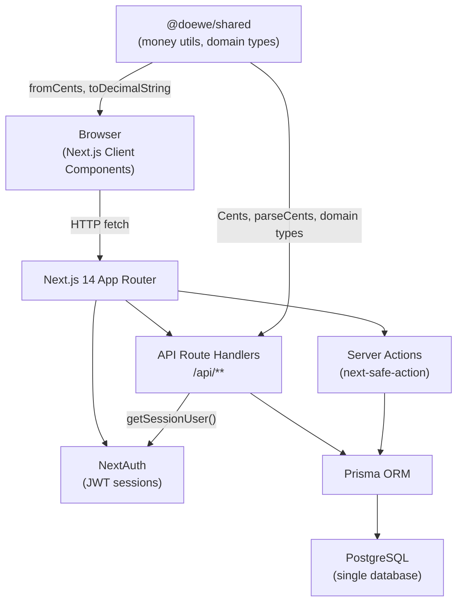

# Doewe — Architecture

## Overview

Doewe is a personal finance management application designed for individual users who want to track income and expenses, manage recurring payments, set monthly budgets per category, and plan savings goals. It runs as a web application and provides a dashboard with analytics, a transaction log, a savings plan, and a monthly review page (`/review`) with income/expense breakdowns. All data is scoped strictly to the authenticated user — multiple users can share the same instance without seeing each other's data (every query filters by `userId` or an account-ownership relation).

---

## System Architecture


```mermaid
graph TD
    Browser["Browser\n(Next.js Client Components)"]
    AppRouter["Next.js 14 App Router"]
    APIRoutes["API Route Handlers\n/api/**"]
    Actions["Server Actions\n(next-safe-action)"]
    Auth["NextAuth\n(JWT sessions)"]
    Prisma["Prisma ORM"]
    Postgres["PostgreSQL\n(single database)"]
    Shared["@doewe/shared\n(money utils, domain types)"]

    Browser -->|"HTTP fetch"| AppRouter
    AppRouter --> APIRoutes
    AppRouter --> Actions
    AppRouter --> Auth
    APIRoutes -->|"getSessionUser()"| Auth
    APIRoutes --> Prisma
    Actions --> Prisma
    Prisma --> Postgres
    Shared -->|"Cents, parseCents, domain types"| APIRoutes
    Shared -->|"fromCents, toDecimalString"| Browser
```

The browser communicates exclusively through the Next.js layer. The main pages are **client components** — both initial data reads and mutations go through the REST-style API route handlers via `fetch` (plus a few Server Actions, e.g. `app/actions/categories.ts` via `next-safe-action`). NextAuth manages the session as a JWT cookie; `middleware.ts` (NextAuth `withAuth`) redirects unauthenticated page requests to `/login`. Prisma translates TypeScript model calls into SQL. The `@doewe/shared` package provides money arithmetic and domain types consumed by both the server (validation, creation) and the client (formatting).

---

## Monorepo Structure

```
Doewe/
├── apps/
│   ├── web/                          # The Next.js application
│   │   ├── middleware.ts             # NextAuth withAuth — protects all pages except public routes
│   │   ├── env.ts                    # Typed env vars (@t3-oss/env-nextjs)
│   │   ├── app/
│   │   │   ├── layout.tsx            # Root layout: AppChrome + MainContainer wrapper
│   │   │   ├── page.tsx              # Dashboard (/)
│   │   │   ├── transactions/         # /transactions page (incl. recurring + skip UI)
│   │   │   ├── budgets/              # Redirect stub → /saving-plan
│   │   │   ├── saving-plan/          # /saving-plan page
│   │   │   ├── review/               # /review — monthly review (KPIs, breakdowns)
│   │   │   ├── settings/             # /settings page
│   │   │   ├── login/                # /login page (public, with demo mode)
│   │   │   ├── forgot-password/      # /forgot-password (public)
│   │   │   ├── reset-password/       # /reset-password (public)
│   │   │   ├── impressum/            # /impressum (public legal page)
│   │   │   ├── datenschutz/          # /datenschutz (public legal page)
│   │   │   ├── actions/              # Server Actions (categories.ts, "use server")
│   │   │   └── api/
│   │   │       ├── auth/             # NextAuth [...nextauth], /register,
│   │   │       │                     # change-password, forgot-password, reset-password
│   │   │       ├── transactions/     # GET, POST, PATCH [id], DELETE [id]
│   │   │       ├── recurring-transactions/  # CRUD + skips sub-resource
│   │   │       ├── budgets/          # GET, POST
│   │   │       ├── saving-plan/      # GET, POST, GET/PATCH/DELETE [id],
│   │   │       │                     # [id]/complete (POST/DELETE), withdraw (POST)
│   │   │       ├── categories/       # GET, POST, PATCH [id], DELETE [id]
│   │   │       ├── accounts/         # GET, POST
│   │   │       ├── demo/             # POST demo/seed (public, idempotent demo data)
│   │   │       └── analytics/
│   │   │           ├── summary/      # Current-month dashboard numbers
│   │   │           ├── quarterly/    # 3-month rolling view
│   │   │           └── monthly-review/ # Deep review of a completed month
│   │   ├── components/
│   │   │   ├── AppChrome.tsx         # Navigation chrome only (no content slot):
│   │   │   │                         # sidebar ≥ md, mobile top bar + drawer, bottom nav
│   │   │   ├── Sidebar.tsx           # Persistent left sidebar at md+ breakpoints
│   │   │   ├── Header.tsx            # Mobile bottom tab bar (fixed bottom, md:hidden) + FAB
│   │   │   ├── TransactionForm.tsx   # Add/edit transaction modal
│   │   │   ├── RecurringTransactionForm.tsx  # Edit recurring transaction (PATCH only)
│   │   │   ├── SearchableSelect.tsx  # Accessible combobox for categories
│   │   │   └── ...                   # Charts, saving widgets, PageContainer, ...
│   │   ├── lib/
│   │   │   ├── auth.ts               # getSessionUser (requireSessionUser exists but is unused)
│   │   │   ├── authOptions.ts        # NextAuth config (CredentialsProvider, JWT callbacks)
│   │   │   ├── prisma.ts             # Singleton PrismaClient
│   │   │   ├── mailer.ts             # Email transport (SMTP/Resend/console fallback)
│   │   │   ├── passwordReset.ts      # Reset-token creation/validation
│   │   │   ├── rateLimit.ts          # In-memory rate limiter for auth endpoints
│   │   │   ├── safe-action.ts        # next-safe-action client
│   │   │   ├── ThemeContext.tsx      # Dark-mode context (+ inline themeScript in layout)
│   │   │   ├── demoData.js           # Demo seed logic (36 months, versioned, idempotent)
│   │   │   ├── config.ts             # App-wide constants
│   │   │   ├── i18n.tsx              # Translation React context
│   │   │   └── locales/              # de.ts (default), en.ts
│   │   ├── tests/                    # Vitest API integration tests
│   │   └── prisma/
│   │       ├── schema.prisma         # Canonical data model
│   │       ├── migrations/           # Prisma migration history
│   │       └── seed.js               # Seed hook → lib/demoData.js
│   └── docs/                         # @doewe/docs — Astro Starlight docs site
│       ├── astro.config.mjs          # Starlight config (sidebar, site/base)
│       └── scripts/sync-docs.mjs     # Mirrors repo-level docs/*.md into the site
├── packages/
│   └── shared/
│       └── src/
│           ├── money.ts              # Cents type, arithmetic helpers
│           ├── strings.ts            # NonEmptyString, ensureNonEmpty
│           ├── domain.ts             # Transaction type, createTransaction
│           └── index.ts              # Re-exports
├── shared/
│   ├── eslint/                       # Shared ESLint config baseline
│   └── tsconfig/                     # Shared TypeScript config baseline
└── vitest.config.ts                  # Global test config (packages/*/src + apps/*/tests)
```

---

## Data Flow — User Creates a Transaction

```mermaid
sequenceDiagram
    actor User
    participant Page as TransactionsPage (Client)
    participant Form as TransactionForm (Client)
    participant API as POST /api/transactions
    participant AuthLib as getSessionUser()
    participant Zod as Zod validation
    participant Prisma as Prisma ORM
    participant DB as PostgreSQL

    User->>Form: Enters amount, description, category, income/expense toggle
    Form->>Form: parseCents(rawInput) → Cents; sign from toggle; occurredAt = now
    Form->>API: POST /api/transactions\n{ accountId, categoryId?, amountCents, description, occurredAt }
    API->>AuthLib: getSessionUser()
    AuthLib-->>API: user or null
    alt Not authenticated
        API-->>Form: 401 Unauthorized
    end
    API->>Zod: TransactionInput.safeParse(body)
    alt Validation fails
        Zod-->>API: flattened Zod error
        API-->>Form: 400 Bad Request + error details
    end
    API->>Prisma: prisma.transaction.create(...)
    Prisma->>DB: INSERT INTO "Transaction" ...
    DB-->>Prisma: new Transaction row
    Prisma-->>API: Transaction object
    API-->>Form: 201 Created + Transaction JSON
    Form->>Page: onSuccess() → re-fetch lists via GET /api/*
    Page-->>User: Transaction appears in list
```

---

## Testing

- Global Vitest config at the repo root (`vitest.config.ts`) includes `packages/*/src` unit tests and `apps/*/tests` integration tests.
- Domain tests: `packages/shared/src/*.test.ts` (money, strings, domain).
- API integration tests: `apps/web/tests/*.test.ts` — they call the route handlers directly against a real (local/CI) Postgres; `pretest` pushes the schema and seeds.
- Component tests run in jsdom with Testing Library (e.g., `components/ui/Button.test.tsx`).

---

## Key Architectural Decisions

### 1. Integer cents for all monetary values (`amountCents: Int`)

**Decision:** Every monetary amount is stored and passed as an integer number of cents.

**Rationale:** Floating-point arithmetic on monetary values causes rounding errors that accumulate over time (e.g., `0.1 + 0.2 !== 0.3` in IEEE 754). Using integers eliminates this class of bug entirely. The `@doewe/shared` package provides a `Cents` branded type and arithmetic helpers (`add`, `sub`, `multiply`) to make this safe at the type level. Display-only conversion (`fromCents`, `toDecimalString`) happens at the UI boundary. (Note: the analytics endpoints divide by 100 at the final JSON output step — see the API reference.)

### 2. Positive = income, negative = expense (sign convention)

**Decision:** A single `amountCents` field carries the sign: positive values are income, negative values are expenses.

**Rationale:** This avoids a separate `type` discriminator field and allows simple arithmetic for balance calculations: `SUM(amountCents)` gives the net position directly. Classification in the analytics endpoints is per transaction: **savings category first** (a transaction in the savings category counts as savings regardless of sign — deposits negative, withdrawals positive), then by sign (`>= 0` income, `< 0` expense). The UI negates the value when the user enters an expense as a positive number.

### 3. Client-component pages over an SPA framework

**Decision:** The app uses the Next.js 14 App Router, but the main pages (`/`, `/transactions`, `/saving-plan`, `/review`, `/settings`, `/login`) are **client components** (`"use client"`) that fetch their data from the API route handlers.

**Rationale:** The pages are highly interactive (forms, charts, optimistic list updates), so a client-side data flow with explicit `fetch` + state keeps the mental model simple and consistent: one REST API serves both reads and writes. Server Components render only the static shell. The trade-off — a larger client bundle and an extra round-trip for the initial data — is acceptable at this app's size.

### 4. Prisma ORM over raw SQL or a query builder

**Decision:** Prisma is the only database access layer; no raw SQL in application code.

**Rationale:** Prisma generates TypeScript types from the schema, which means every query result is fully typed. Migrations are tracked as SQL files in version control. The schema-first approach makes the data model the single source of truth and eliminates the N+1 problems that ORMs can introduce (Prisma uses `include` for eager loading).

### 5. `@doewe/shared` as an internal package

**Decision:** Money utilities and core domain types live in a separate `packages/shared` workspace package consumed by both the `apps/web` server code and the client.

**Rationale:** Sharing code between the server (API routes, seeder) and the client (form validation, display formatting) without duplication. The package boundary also enforces that domain rules (e.g., `Cents` must be an integer, `NonEmptyString` must be non-empty) are validated once and reused everywhere.

### 6. Auth guard in every route handler via `getSessionUser()`

**Decision:** Every API route calls `getSessionUser()` at the top of the handler and returns `401` itself when the result is `null`, before any DB access. (A throwing variant `requireSessionUser()` exists in `lib/auth.ts` but is currently unused.)

**Rationale:** Centralizing the session read in a single function prevents accidental omission. The returned user id is then threaded into every Prisma query as a `userId` filter or via an account-ownership check, ensuring users can only read and write their own data. Page-level protection is handled separately by `middleware.ts` (NextAuth `withAuth`), which excludes the public routes (login, register, password reset, legal pages, `api/demo`).

### 7. Savings identified by category name, not a dedicated model field

**Decision:** A category is treated as a savings category when its name matches "savings" or "sparen" (case-insensitive), rather than having a boolean `isSavings` flag or a separate model.

**Rationale:** Keeps the data model simple for the MVP. The analytics endpoints apply this convention when computing the savings component of the monthly summary. To keep the convention safe, the API protects these category names: they cannot be created, renamed, or deleted (`403`).
