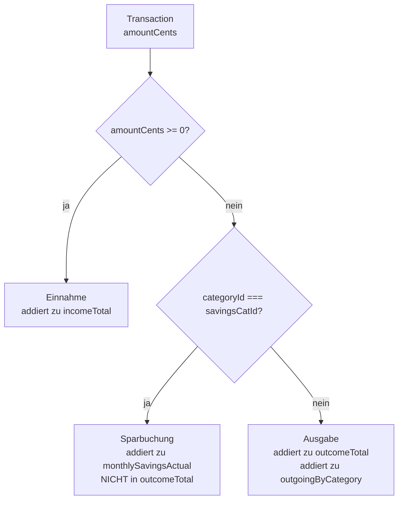

# Transaktionen — Klassifizierung und Verhalten

**Quellen:**
- `apps/web/app/api/transactions/route.ts`
- `apps/web/app/api/analytics/summary/route.ts` (Klassifizierungs-Logik)
- `packages/shared/src/domain.ts`

## Transaktion-Typen

Eine Transaktion hat keinen expliziten "Typ"-Enum. Die Klassifizierung erfolgt **ausschließlich über das Vorzeichen von `amountCents`** und die zugewiesene Kategorie:



## Spar-Kategorie-Erkennung

Die Spar-Kategorie wird **nicht per Flag in der DB** markiert, sondern über den **Namen erkannt**:

```typescript
const SAVINGS_NAMES = ["savings", "sparen"];
const savingsCategory = allUserCategories.find(c =>
  SAVINGS_NAMES.includes(c.name.toLowerCase().trim())
);
```

- Schreibung egal: "Savings", "SPAREN", "savings" — alle werden erkannt
- **Leerzeichen am Rand** werden via `.trim()` entfernt
- Nur die beiden Wörter `savings` und `sparen` werden erkannt — nichts anderes
- Wenn keine solche Kategorie existiert, gibt es keine Sparerkennung

## Sparbuchung-Konvention

Sparbuchungen müssen **negative `amountCents`** haben (Abgang vom Girokonto zum Sparkonto).

```
Sparbuchung: amountCents = -20000  (= -200,00 €)
→ wird als Sparen gewertet, NICHT als Ausgabe
→ monthlySavingsActual += 200,00
```

Ein Sparbuchungs-Eingang (positiver Betrag in savings-Kategorie) würde als **Einnahme** gezählt — das ist ein Grenzfall und sollte in der UI verhindert werden.

## savingGoalId — Verknüpfung mit Sparzielen

Transaktionen können optional mit einem `Budget`-Eintrag (Sparziel) verknüpft werden:

```typescript
savingGoalId?: string  // Optional, zeigt auf Budget.id
```

Diese Verknüpfung wird im `saving-plan`-Endpoint ausgewertet:

```typescript
// saving-plan/route.ts
transactionSpentCents: goal.transactions.reduce(
  (sum, tx) => sum + Math.abs(tx.amountCents), 0
)
```

- Es werden **alle verknüpften Transaktionen** summiert
- `Math.abs()` — also egal ob positiv oder negativ, der absolute Betrag zählt
- Dieser Wert zeigt, wie viel bereits auf ein Sparziel eingezahlt wurde

## API: POST /api/transactions

**Validierung:**
- `accountId` — muss dem eingeloggten Nutzer gehören
- `amountCents` — Integer, kein Float
- `description` — nicht leer
- `occurredAt` — ISO-Datums-String
- `categoryId` — optional, muss dem Nutzer gehören
- `savingGoalId` — optional, muss dem Nutzer gehören

**Kein automatisches Buchungsdatum** — `occurredAt` wird immer explizit übergeben.

## Zeitberechnung (wichtig für UTC)

```typescript
// domain.ts
function toISODate(value: Date | string): string {
  if (value instanceof Date) return value.toISOString();
  const d = new Date(value);
  if (Number.isNaN(d.getTime())) throw new Error(`Invalid date: ${value}`);
  return d.toISOString();
}
```

`occurredAt` wird immer als **UTC ISO-String** gespeichert. Bei Tages-Berechnungen (Chart) wird `occurredAt.getDate()` verwendet — das ist der **lokale Tag des Servers** (oder UTC je nach Umgebung). Hier kann es zu Off-by-one-Fehlern kommen wenn Server und User in unterschiedlichen Zeitzonen arbeiten.
