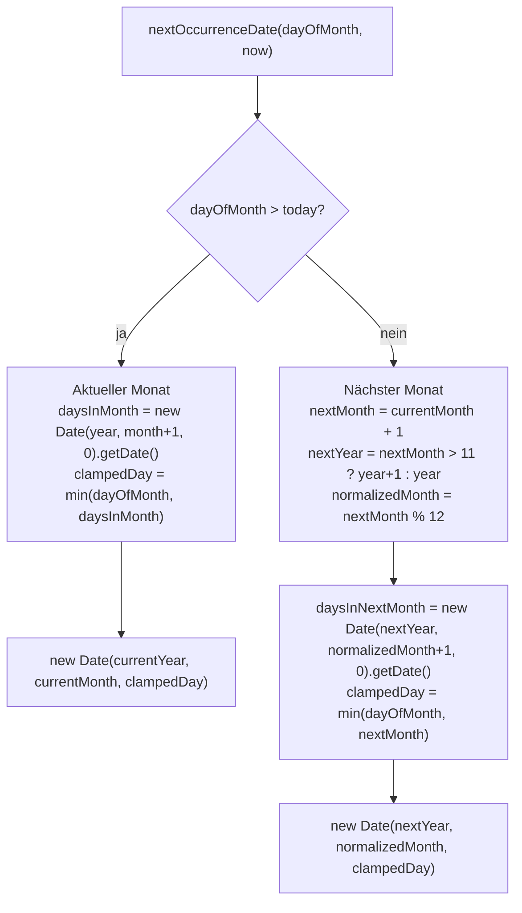
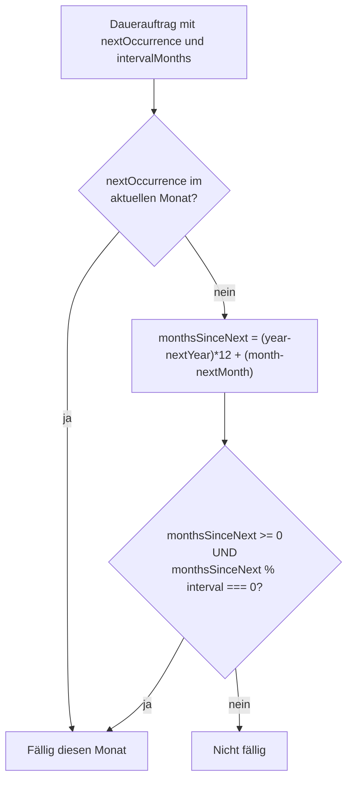

# Wiederkehrende Transaktionen (Daueraufträge)

**Quellen:**
- `apps/web/app/api/recurring-transactions/route.ts`
- `apps/web/app/api/recurring-transactions/[id]/route.ts`
- `apps/web/app/api/recurring-transactions/skips/route.ts`
- `apps/web/app/api/analytics/summary/route.ts` (Filterlogik)

## Was sind Daueraufträge?

Daueraufträge sind **Vorlagen** für regelmäßige Buchungen (z.B. Miete, Gehalt, Abonnements).

**Wichtig:** Sie werden **NICHT automatisch als echte Transaktionen angelegt**. Stattdessen:
- Im Dashboard werden sie als "geplante" Beträge in Projektionen eingerechnet
- Die tatsächliche Buchung muss manuell erfolgen

## Datenmodell

```
RecurringTransaction
├── amountCents    — positiv = Einnahme, negativ = Ausgabe
├── frequency      — immer "MONTHLY" (andere Werte vorbereitet aber nie gesetzt)
├── intervalMonths — 1-24: Abstand in Monaten (1 = jeden Monat, 3 = quartalsweise)
├── dayOfMonth     — 1-31: Tag des Monats, an dem gebucht wird
└── nextOccurrence — berechnetes nächstes Fälligkeitsdatum (DateTime)
```

## nextOccurrence-Berechnung

Beim **Anlegen** (POST) und beim **Ändern von dayOfMonth** (PATCH) wird `nextOccurrence` neu berechnet:



**Clamping-Beispiel:**
- `dayOfMonth = 31`, Februar → clampedDay = 28 (oder 29 im Schaltjahr)
- `dayOfMonth = 30`, Februar → clampedDay = 28

**Beispiel am 10. Juni 2026:**

| dayOfMonth | Ergebnis |
|---|---|
| 15 | 2026-06-15 (noch nicht vergangen) |
| 1 | 2026-07-01 (bereits vergangen) |
| 10 | 2026-07-10 (heute = vergangen, daher nächsten Monat) |
| 31 | 2026-06-30 (clamp: Juni hat 30 Tage) |

## Fälligkeits-Filter im Analytics-Dashboard

Im Summary-Endpoint wird entschieden, welche Daueraufträge im **aktuellen Monat fällig** sind:

```typescript
const recurringThisMonth = recurringTransactions.filter((rec) => {
  const nextDate = new Date(rec.nextOccurrence);
  const nextYear = nextDate.getFullYear();
  const nextMonth = nextDate.getMonth() + 1;

  // Fall 1: nextOccurrence fällt exakt in den aktuellen Monat
  if (nextYear === year && nextMonth === month) return true;

  // Fall 2: Intervall-Berechnung — ist dieser Monat ein Fälligkeitsmonat?
  const interval = rec.intervalMonths || 1;
  const monthsSinceNext = (year - nextYear) * 12 + (month - nextMonth);
  return monthsSinceNext >= 0 && monthsSinceNext % interval === 0;
});
```



**Beispiel — quartalsweiser Dauerauftrag (intervalMonths=3):**

| nextOccurrence | Aktueller Monat | monthsSinceNext | % 3 | Fällig? |
|---|---|---|---|---|
| 2026-01 | 2026-01 | 0 | 0 | Ja |
| 2026-01 | 2026-02 | 1 | 1 | Nein |
| 2026-01 | 2026-03 | 2 | 2 | Nein |
| 2026-01 | 2026-04 | 3 | 0 | Ja |
| 2026-01 | 2026-07 | 6 | 0 | Ja |

## Skips — Einmaliges Überspringen

Ein Dauerauftrag kann für einen bestimmten Monat übersprungen werden:

```
RecurringTransactionSkip
├── recurringId  — Verweis auf RecurringTransaction
├── year         — Jahr des zu überspringenden Monats
└── month        — Monat (1-12)

Unique: (recurringId, year, month)
```

**Im Analytics-Dashboard:**

```typescript
const skippedIds = new Set(skips.map(s => s.recurringId));
const activeRecurringThisMonth = recurringThisMonth.filter(r => !skippedIds.has(r.id));
```

Geskippte Daueraufträge werden aus den Projektionen **vollständig entfernt**.

## API-Endpunkte

| Methode | Endpoint | Beschreibung |
|---|---|---|
| GET | `/api/recurring-transactions` | Alle Daueraufträge des Nutzers |
| POST | `/api/recurring-transactions` | Neuen Dauerauftrag anlegen |
| PATCH | `/api/recurring-transactions/[id]` | Dauerauftrag bearbeiten |
| DELETE | `/api/recurring-transactions/[id]` | Dauerauftrag löschen |
| GET | `/api/recurring-transactions/skips?year=&month=` | Skips für einen Monat |
| POST | `/api/recurring-transactions/skips` | Skip hinzufügen (upsert) |
| DELETE | `/api/recurring-transactions/skips` | Skip entfernen |
