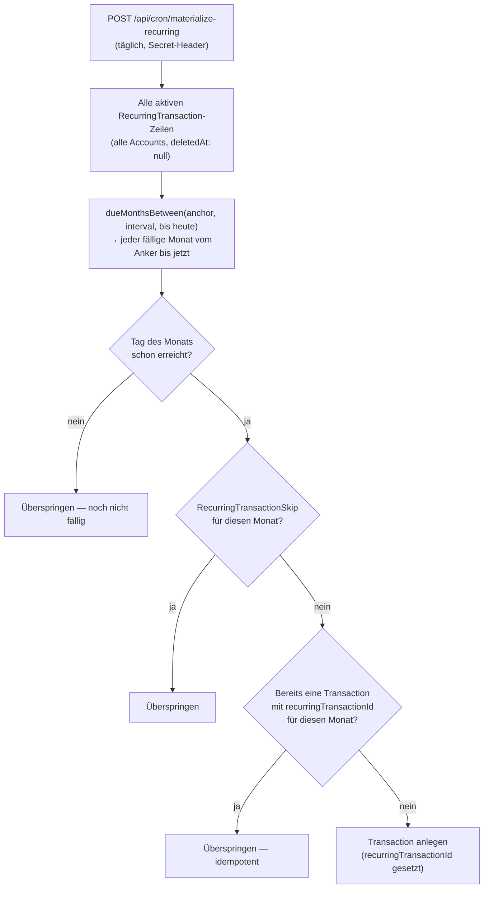
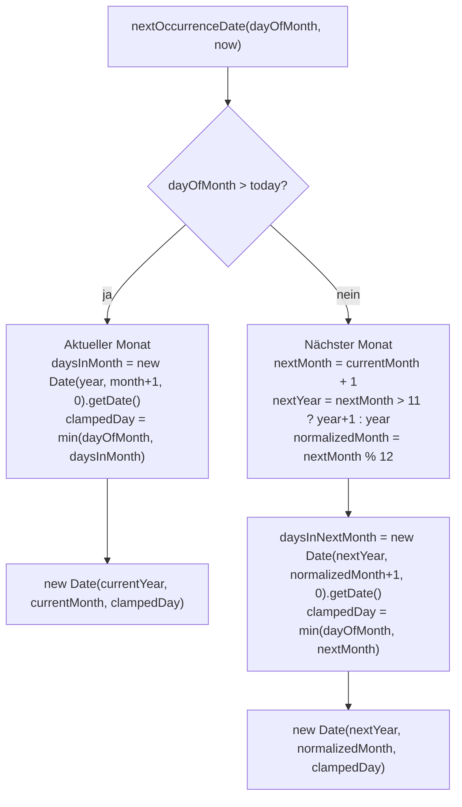
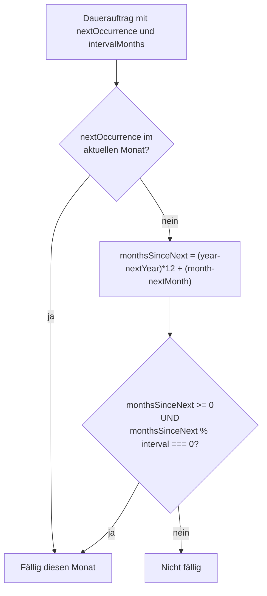

# Wiederkehrende Transaktionen (Daueraufträge)

**Quellen:**
- `apps/web/app/api/recurring-transactions/route.ts`
- `apps/web/app/api/recurring-transactions/[id]/route.ts`
- `apps/web/app/api/recurring-transactions/skips/route.ts`
- `apps/web/app/api/analytics/summary/route.ts` (Filterlogik)
- `apps/web/lib/recurringBooking.ts` (automatisches Buchen)
- `apps/web/app/api/cron/materialize-recurring/route.ts` (täglicher Cron-Trigger)

## Was sind Daueraufträge?

Daueraufträge sind **Vorlagen** für regelmäßige Buchungen (z.B. Miete, Gehalt, Abonnements).

**Seit dem `materialize-recurring`-Cron (täglich) werden fällige Daueraufträge automatisch als echte `Transaction`-Zeile gebucht**, sobald ihr `dayOfMonth` erreicht ist — vorher galt hier "nie automatisch", das ist überholt. Solange der Cron nicht gelaufen ist (z.B. lokal ohne konfigurierten Trigger), fließt ein fälliger, noch nicht gebuchter Dauerauftrag weiterhin nur als "geplanter" Betrag in die Projektionen ein (siehe unten) — das ist der Übergangszustand, kein Dauerzustand.

## Automatisches Buchen (`materializeDueRecurringTransactions`)


```mermaid
flowchart TD
    CRON["POST /api/cron/materialize-recurring\n(täglich, Secret-Header)"] --> ALL["Alle aktiven RecurringTransaction-Zeilen\n(alle Accounts, deletedAt: null)"]
    ALL --> DUE["dueMonthsBetween(anchor, interval, bis heute)\n→ jeder fällige Monat vom Anker bis jetzt"]
    DUE --> DAY{"Tag des Monats\nschon erreicht?"}
    DAY -->|nein| SKIP_FUTURE["Überspringen — noch nicht fällig"]
    DAY -->|ja| SKIPPED{"RecurringTransactionSkip\nfür diesen Monat?"}
    SKIPPED -->|ja| SKIP["Überspringen"]
    SKIPPED -->|nein| BOOKED{"Bereits eine Transaction\nmit recurringTransactionId\nfür diesen Monat?"}
    BOOKED -->|ja| SKIP2["Überspringen — idempotent"]
    BOOKED -->|nein| CREATE["Transaction anlegen\n(recurringTransactionId gesetzt)"]
```

**Wichtig — dieselbe Funktion holt sowohl den Tagesbetrieb als auch die Vergangenheit nach:** `dueMonthsBetween` listet jeden fälligen Monat vom Anker (`nextOccurrence`) bis heute. Ein Dauerauftrag, der seit Monaten nie gebucht wurde, bekommt beim ersten Lauf alle fehlenden Monate auf einmal nachgebucht — mit dem **aktuell hinterlegten Betrag** (kein historischer Betrags-Snapshot). Hat sich ein Betrag zwischenzeitlich geändert (z.B. Nebenkosten-Abschlag), werden vergangene Monate mit dem falschen (aktuellen) Betrag befüllt — in diesem Fall muss die betroffene Transaktion manuell korrigiert werden.

**Idempotenz:** Ein Monat gilt als gebucht, sobald irgendeine `Transaction` mit passendem `recurringTransactionId` in diesem Monat existiert — ein zweiter Cron-Lauf am selben Tag bucht nichts doppelt.

**Doppelzählung vermieden:** Sobald ein Vorkommen gebucht ist, zählt es nicht mehr zusätzlich in `recurringIncomeTotal`/`recurringOutcomeTotal`/`recurringPlannedSavings` (siehe [04-analytics-summary.md](./04-analytics-summary.md)) — sonst stünde derselbe Betrag einmal als echte Buchung und einmal als "geplant" in der Summe.

## Datenmodell

```
RecurringTransaction
├── amountCents    — positiv = Einnahme, negativ = Ausgabe
├── frequency      — immer "MONTHLY" (andere Werte vorbereitet aber nie gesetzt)
├── intervalMonths — 1-24: Abstand in Monaten (1 = jeden Monat, 3 = quartalsweise)
├── dayOfMonth     — 1-31: Tag des Monats, an dem gebucht wird
└── nextOccurrence — Ankerdatum der Serie = erste Buchung (DateTime); automatisch aus
                     dayOfMonth berechnet ODER direkt aus einem optionalen Startdatum gesetzt
```

## nextOccurrence-Berechnung

`nextOccurrence` ist der **Anker** der Serie — die Fälligkeits-Logik weiter unten rechnet von diesem Datum aus. Er wird auf zwei Wegen gesetzt:

- **Explizites Startdatum:** Wird beim Anlegen (POST) oder Bearbeiten (PATCH) ein `startDate` (`yyyy-mm-dd`) übergeben, ist dieses Datum die erste Buchung und `nextOccurrence` wird direkt darauf gesetzt — z.B. ein Abo, dessen erste Zahlung erst in zwei Monaten fällig ist. Ein in der Zukunft liegender Anker wird erst ab seinem Startmonat eingerechnet (`monthsSinceNext >= 0`, siehe unten).
- **Automatisch aus `dayOfMonth`:** Ohne `startDate` wird `nextOccurrence` beim Anlegen (POST) und beim Ändern von `dayOfMonth` (PATCH) wie folgt berechnet:


```mermaid
flowchart TD
    A["nextOccurrenceDate(dayOfMonth, now)"] --> B{dayOfMonth > today?}
    B -->|ja| C["Aktueller Monat\ndaysInMonth = new Date(year, month+1, 0).getDate()\nclampedDay = min(dayOfMonth, daysInMonth)"]
    C --> D["new Date(currentYear, currentMonth, clampedDay)"]
    B -->|nein| E["Nächster Monat\nnextMonth = currentMonth + 1\nnextYear = nextMonth > 11 ? year+1 : year\nnormalizedMonth = nextMonth % 12"]
    E --> F["daysInNextMonth = new Date(nextYear, normalizedMonth+1, 0).getDate()\nclampedDay = min(dayOfMonth, nextMonth)"]
    F --> G["new Date(nextYear, normalizedMonth, clampedDay)"]
```

**Clamping-Beispiel:**
- `dayOfMonth = 31`, Februar → clampedDay = 28 (oder 29 im Schaltjahr)
- `dayOfMonth = 30`, Februar → clampedDay = 28

**Beispiel am 10. Juni 2026:**

| dayOfMonth | Ergebnis |
|---|---|
| 15 | 2026-06-15 (noch nicht vergangen) |
| 1 | 2026-07-01 (bereits vergangen) |
| 10 | 2026-07-10 (heute = vergangen, daher nächsten Monat) |
| 31 | 2026-06-30 (clamp: Juni hat 30 Tage) |

## Fälligkeits-Filter im Analytics-Dashboard

Im Summary-Endpoint wird entschieden, welche Daueraufträge im **aktuellen Monat fällig** sind:

```typescript
const recurringThisMonth = recurringTransactions.filter((rec) => {
  const nextDate = new Date(rec.nextOccurrence);
  const nextYear = nextDate.getFullYear();
  const nextMonth = nextDate.getMonth() + 1;

  // Fall 1: nextOccurrence fällt exakt in den aktuellen Monat
  if (nextYear === year && nextMonth === month) return true;

  // Fall 2: Intervall-Berechnung — ist dieser Monat ein Fälligkeitsmonat?
  const interval = rec.intervalMonths || 1;
  const monthsSinceNext = (year - nextYear) * 12 + (month - nextMonth);
  return monthsSinceNext >= 0 && monthsSinceNext % interval === 0;
});
```


```mermaid
flowchart TD
    A["Dauerauftrag mit nextOccurrence und intervalMonths"] --> B{nextOccurrence im\naktuellen Monat?}
    B -->|ja| ACTIVE["Fällig diesen Monat"]
    B -->|nein| C["monthsSinceNext = (year-nextYear)*12 + (month-nextMonth)"]
    C --> D{monthsSinceNext >= 0\nUND\nmonthsSinceNext % interval === 0?}
    D -->|ja| ACTIVE
    D -->|nein| INACTIVE["Nicht fällig"]
```

**Beispiel — quartalsweiser Dauerauftrag (intervalMonths=3):**

| nextOccurrence | Aktueller Monat | monthsSinceNext | % 3 | Fällig? |
|---|---|---|---|---|
| 2026-01 | 2026-01 | 0 | 0 | Ja |
| 2026-01 | 2026-02 | 1 | 1 | Nein |
| 2026-01 | 2026-03 | 2 | 2 | Nein |
| 2026-01 | 2026-04 | 3 | 0 | Ja |
| 2026-01 | 2026-07 | 6 | 0 | Ja |

## Skips — Einmaliges Überspringen

Ein Dauerauftrag kann für einen bestimmten Monat übersprungen werden:

```
RecurringTransactionSkip
├── recurringId  — Verweis auf RecurringTransaction
├── year         — Jahr des zu überspringenden Monats
└── month        — Monat (1-12)

Unique: (recurringId, year, month)
```

**Im Analytics-Dashboard:**

```typescript
const skippedIds = new Set(skips.map(s => s.recurringId));
const activeRecurringThisMonth = recurringThisMonth.filter(r => !skippedIds.has(r.id));
```

Geskippte Daueraufträge werden aus den Projektionen **vollständig entfernt**.

## API-Endpunkte

| Methode | Endpoint | Beschreibung |
|---|---|---|
| GET | `/api/recurring-transactions` | Alle Daueraufträge des Nutzers |
| POST | `/api/recurring-transactions` | Neuen Dauerauftrag anlegen |
| PATCH | `/api/recurring-transactions/[id]` | Dauerauftrag bearbeiten |
| DELETE | `/api/recurring-transactions/[id]` | Dauerauftrag löschen |
| GET | `/api/recurring-transactions/skips?year=&month=` | Skips für einen Monat |
| POST | `/api/recurring-transactions/skips` | Skip hinzufügen (upsert) |
| DELETE | `/api/recurring-transactions/skips` | Skip entfernen |
