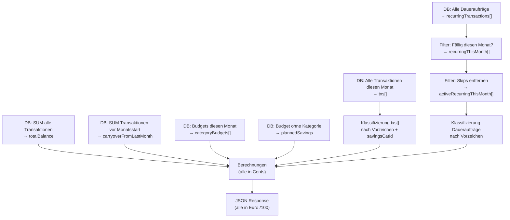
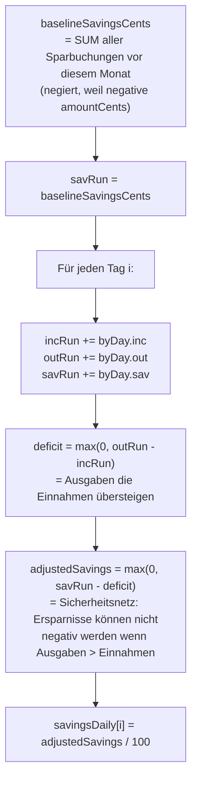

# Analytics Summary — Monatliche Dashboard-Kennzahlen

**Quelle:** `apps/web/app/api/analytics/summary/route.ts`
**Endpoint:** `GET /api/analytics/summary`

## Überblick

Der Summary-Endpoint ist das Herzstück des Dashboards. Er liefert alle Finanzkennzahlen für den **aktuellen Monat** — kombiniert echte Transaktionen mit noch nicht gebuchten Daueraufträgen.

**Einschränkung:** Nur das **erste Konto** des Nutzers (ältestes nach `createdAt`) wird ausgewertet.

## Berechnungsfluss



## Alle Kennzahlen im Detail

### Kontostände

| Feld | Formel | Beschreibung |
|---|---|---|
| `totalBalance` | `SUM(amountCents) / 100` | Summe ALLER Transaktionen aller Zeiten |
| `carryoverFromLastMonth` | `SUM(amountCents WHERE occurredAt < Monatsstart) / 100` | Kontostand am Ende des Vormonats |

### Monatstotale (nur echte Transaktionen)

| Feld | Formel | Beschreibung |
|---|---|---|
| `incomeTotal` | `SUM(amt) WHERE amt >= 0` | Einnahmen diesen Monat |
| `outcomeTotal` | `SUM(-amt) WHERE amt < 0 AND catId != savingsCatId` | Ausgaben (ohne Sparen) |
| `monthlySavingsActual` | `SUM(-amt) WHERE amt < 0 AND catId == savingsCatId` | Tatsächliche Sparbuchungen |
| `remaining` | `incomeTotal - outcomeTotal - monthlySavingsActual` | Tatsächlich verfügbares Restgeld |

### Dauerauftrag-Summierung (nur aktive, nicht-geskippte)

| Feld | Formel | Beschreibung |
|---|---|---|
| `recurringIncomeTotal` | `SUM(amt) WHERE amt >= 0` | Geplante Einnahmen aus Daueraufträgen |
| `recurringOutcomeTotal` | `SUM(-amt) WHERE amt < 0 AND catId != savingsCatId` | Geplante Ausgaben (ohne Sparen) |
| `recurringPlannedSavings` | `SUM(-amt) WHERE amt < 0 AND catId == savingsCatId` | Geplante Sparbuchungen aus Daueraufträgen |

Analog zur Trennung bei echten Transaktionen (`monthlySavingsActual` vs. `outcomeTotal`) werden auch Dauerauftrags-Sparbuchungen separat erfasst und nicht in `recurringOutcomeTotal` eingemischt.

### Projektionen (echte + geplante Transaktionen)

| Feld | Formel | Beschreibung |
|---|---|---|
| `projectedIncomeTotal` | `incomeTotal + recurringIncomeTotal` | Hochrechnung Einnahmen |
| `projectedOutcomeTotal` | `outcomeTotal + recurringOutcomeTotal` | Hochrechnung Ausgaben (ohne Sparen) |
| `projectedSavingsTotal` | `monthlySavingsActual + recurringPlannedSavings` | Gesamtes geplantes Sparen (gebucht + geplant) |
| `projectedRemaining` | `projectedIncomeTotal - projectedOutcomeTotal - projectedSavingsTotal` | Voraussichtlich verbleibendes Geld |

### Kategorien-Ausgaben

```typescript
outgoingByCategory: [
  { id, name, amount }  // amount in Euro
]
```

- Echte Ausgaben + Dauerauftrags-Ausgaben pro Kategorie zusammengefasst
- `uncategorized` = Transaktionen ohne Kategorie
- Spar-Buchungen sind **nicht enthalten**

### Budget vs. Ist

```typescript
categoryBudgets: [
  {
    categoryId,
    name,
    budget,   // Ziel in Euro
    spent,    // Tatsächliche Ausgaben in Euro
    diff      // (spentCents - budgetCents) / 100
              // positiv = über Budget, negativ = unter Budget
  }
]
```

### Geplantes Sparen

```typescript
plannedSavings  // Budget ohne categoryId (=Spar-Budget) für diesen Monat, in Euro
```

## Tages-Chart (daily)

Das Chart zeigt **kumulierte Werte** — jeder Tag ist die Summe aller Tage bis einschließlich diesem Tag.

### Daten-Sammlung

Für jeden Tag des Monats wird ein Bucket `{ inc, out, sav }` in Cents befüllt:

1. **Echte Transaktionen:** `day = occurredAt.getDate() - 1` → Bucket-Index
2. **Daueraufträge:** `day = Math.min(dayOfMonth, daysInMonth) - 1` → Bucket-Index

### Kumulierung und Savings-Anpassung

```typescript
let incRun = 0, outRun = 0;
let savRun = baselineSavingsCents;  // Alle Sparbuchungen VOR diesem Monat

for (let i = 0; i < daysInMonth; i++) {
  incRun += byDay[i].inc;
  outRun += byDay[i].out;
  savRun += byDay[i].sav;

  const deficit = Math.max(0, outRun - incRun);
  const adjustedSavings = Math.max(0, savRun - deficit);

  incomeDaily[i] = incRun / 100;
  outcomeDaily[i] = outRun / 100;
  savingsDaily[i] = adjustedSavings / 100;
}
```



**Bedeutung der Savings-Anpassung:**
Wenn die Ausgaben die Einnahmen übersteigen (Defizit), wird das Defizit von den kumulierten Ersparnissen subtrahiert. Das verhindert, dass der Savings-Chart negativ wird. `savRun` selbst bleibt unverändert — `adjustedSavings` ist nur der Anzeigewert.

### Response-Format

```typescript
daily: {
  labels: ["1", "2", ..., "30"],  // Tages-Nummern als String
  income: number[],   // Kumulierte Einnahmen pro Tag in Euro
  outcome: number[],  // Kumulierte Ausgaben pro Tag in Euro
  savings: number[]   // Kumulierte Ersparnisse (angepasst) pro Tag in Euro
}
```

## Vollständiger Response

```typescript
{
  totalBalance: number,
  carryoverFromLastMonth: number,
  incomeTotal: number,
  outcomeTotal: number,
  outcomeTotalExclSavings: number,   // identisch mit outcomeTotal (Redundanz)
  monthlySavingsActual: number,
  remaining: number,
  plannedSavings: number,
  projectedIncomeTotal: number,
  projectedOutcomeTotal: number,
  projectedSavingsTotal: number,     // monthlySavingsActual + recurringPlannedSavings
  projectedRemaining: number,
  outgoingByCategory: { id, name, amount }[],
  categoryBudgets: { categoryId, name, budget, spent, diff }[],
  recurringTransactions: { id, description, amountCents, categoryId, dayOfMonth }[],
  recurringIncomeTotal: number,
  recurringOutcomeTotal: number,
  recurringPlannedSavings: number,   // Dauerauftrags-Sparbuchungen (separiert)
  daily: { labels, income, outcome, savings }
}
```

## Simulationsbeispiel

**Ausgangslage — Juni 2026:**
- Vormonat-Kontostand: 1.500,00 €
- Gehaltseingang am 1.6.: 3.000,00 €
- Miete am 3.6. (bereits gebucht): -1.200,00 €
- Sparbuchung am 5.6.: -500,00 € (Kategorie "Sparen")
- Dauerauftrag Streaming am 15.6. (noch nicht als Tx): -15,00 €
- Dauerauftrag Sparplan am 28.6. (Kategorie "Sparen"): -200,00 €

| Feld | Berechnung | Wert |
|---|---|---|
| `totalBalance` | 1500 + 3000 - 1200 - 500 = 2800 | 2800,00 € |
| `carryoverFromLastMonth` | 1500 | 1500,00 € |
| `incomeTotal` | 3000 | 3000,00 € |
| `outcomeTotal` | 1200 (Miete) | 1200,00 € |
| `monthlySavingsActual` | 500 (bereits gebucht) | 500,00 € |
| `remaining` | 3000 - 1200 - 500 | 1300,00 € |
| `recurringOutcomeTotal` | 15 (Streaming) | 15,00 € |
| `recurringPlannedSavings` | 200 (Sparplan-DA) | 200,00 € |
| `projectedOutcomeTotal` | 1200 + 15 | 1215,00 € |
| `projectedSavingsTotal` | 500 + 200 | 700,00 € |
| `projectedRemaining` | 3000 - 1215 - 700 | 1085,00 € |
