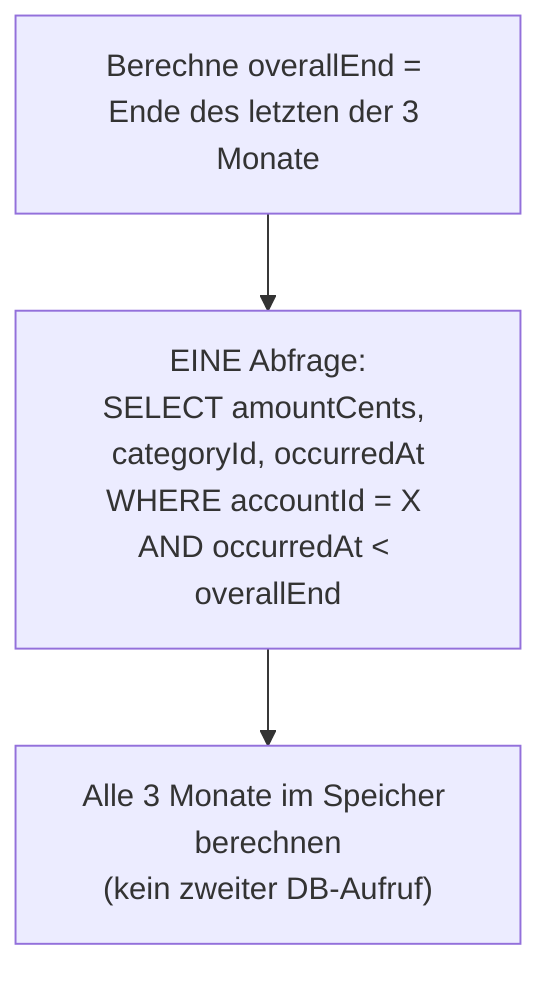
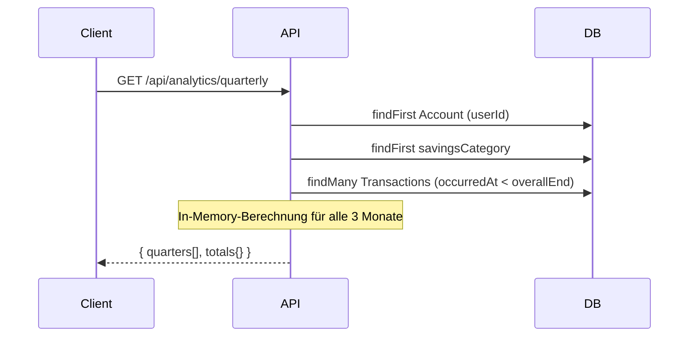

# Analytics Quarterly — Quartalübersicht

**Quelle:** `apps/web/app/api/analytics/quarterly/route.ts`
**Endpoint:** `GET /api/analytics/quarterly`

## Zweck

Zeigt die Finanzdaten der **letzten 3 Monate** (inkl. aktuellem Monat) für einen Vergleich über Zeit.

## Zeitraum-Berechnung

```typescript
// Letzte 3 Monate inkl. aktuellem Monat (rückwärts)
for (let i = 2; i >= 0; i--) {
  const date = new Date(currentYear, currentMonth - i, 1);
  months.push({ month: date.getMonth() + 1, year: date.getFullYear() });
}
```

**Beispiel am 10. Juni 2026:** Monate = `[April 2026, Mai 2026, Juni 2026]`

JavaScript's `Date`-Konstruktor behandelt negative Monatswerte korrekt (Überlauf in Vorjahr), daher kein manuelles Jahres-Rollover nötig.

## Datenbankabfrage (optimiert)



**Performance-Entscheidung:** Statt 3 separater Queries (O(n²) DB-Aufwand) wird einmal alles abgefragt und im Speicher iteriert. Für große Transaktionshistorien kann das viel Speicher verbrauchen.

## Berechnungslogik pro Monat

```typescript
for (const t of allTxs) {
  const tMs = t.occurredAt.getTime();

  // Kumulativer Kontostand bis Monatsende
  if (tMs < endMs) {
    balance += t.amountCents;
  }

  // Monatseinzelwerte
  if (tMs >= startMs && tMs < endMs) {
    if (amt >= 0) income += amt;
    else if (savingsCatId && t.categoryId === savingsCatId) savings += -amt;
    else outcome += -amt;
  }
}
```

| Feld | Formel | Beschreibung |
|---|---|---|
| `incomeCents` | `SUM(amt >= 0)` im Monat | Einnahmen des Monats |
| `outcomeCents` | `SUM(-amt < 0, nicht savings)` im Monat | Ausgaben des Monats |
| `savingsCents` | `SUM(-amt < 0, savings-Kat.)` im Monat | Sparbuchungen des Monats |
| `balanceCents` | `SUM(alle Tx vor Monatsende)` | Kumulativer Kontostand am Monatsende |

**Wichtig:** `balance` akkumuliert über die gesamte Transaktionshistorie bis zum Monatsende — nicht nur die Transaktionen des jeweiligen Monats.

## Response-Format

```typescript
{
  quarters: [
    {
      month: number,        // 1-12
      year: number,
      incomeCents: number,
      outcomeCents: number,
      savingsCents: number,
      balanceCents: number  // kumulativer Kontostand am Ende dieses Monats
    },
    // ... 3 Einträge gesamt
  ],
  totals: {
    incomeCents: number,    // Summe der 3 Monate
    outcomeCents: number,
    savingsCents: number
    // kein balanceCents-Total — würde keinen Sinn ergeben
  }
}
```

**Achtung:** Alle Werte im Response sind in **Cents** (Integer), NICHT in Euro. Das unterscheidet sich vom Summary-Endpoint.

## Diagramm: Datenfluss



## Simulationsbeispiel

**Aktueller Monat: Juni 2026**

| Monat | Einnahmen | Ausgaben | Sparen | Kontostand am Monatsende |
|---|---|---|---|---|
| April 2026 | 3.000,00 € | 1.500,00 € | 300,00 € | 5.200,00 € |
| Mai 2026 | 3.000,00 € | 1.800,00 € | 300,00 € | 5.800,00 € |
| Juni 2026 | 3.000,00 € | 1.200,00 € | 500,00 € | 7.100,00 € |
| **Gesamt** | **9.000,00 €** | **4.500,00 €** | **1.100,00 €** | — |

Werte im Response in Cents: `incomeCents: 900000`, `outcomeCents: 450000`, etc.
