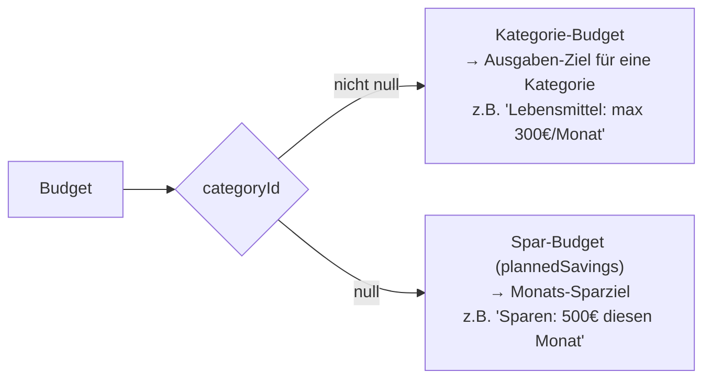

# Budgets — Ziele vs. tatsächliche Ausgaben

**Quellen:**
- `apps/web/app/api/budgets/route.ts`
- `apps/web/app/api/analytics/summary/route.ts` (Budget-Auswertung)

## Was ist ein Budget?

Ein Budget definiert einen **Ziel-Betrag** für eine Kategorie in einem bestimmten Monat.

```
Budget
├── accountId   — Konto
├── categoryId  — Kategorie (null = Spar-Budget)
├── month       — 1-12
├── year
├── amountCents — Ziel-Betrag (positiv)
└── title       — optionaler Titel (Default "")
```

**Unique-Constraint:** `(accountId, categoryId, month, year)` — pro Kategorie/Monat nur ein Budget.

## Zwei Budget-Typen



## Budget-Auswertung im Dashboard

Im Summary-Endpoint wird pro Kategorie-Budget berechnet:

```typescript
const categoryBudgets = categoryBudgetsRaw.map(b => {
  const spentCents = byCategoryCents[b.categoryId] ?? 0;
  const budgetCents = b.amountCents;
  return {
    categoryId: b.categoryId,
    name: updatedNameMap[b.categoryId] ?? b.categoryId,
    budget: budgetCents / 100,
    spent: spentCents / 100,
    diff: (spentCents - budgetCents) / 100
  };
});
```

| Feld | Bedeutung |
|---|---|
| `budget` | Geplanter Betrag (Ziel) |
| `spent` | Tatsächliche Ausgaben + Dauerauftrags-Ausgaben dieser Kategorie |
| `diff` | `spent - budget`: positiv = über Budget, negativ = unter Budget |

**Was in `spent` einfließt:**
- Echte Transaktionen dieser Kategorie diesen Monat (nur Ausgaben, amountCents < 0)
- Aktive, nicht-geskippte Daueraufträge dieser Kategorie (`recurringByCategoryCents`)

## Spar-Budget (plannedSavings)

```typescript
const plannedBudgetAgg = await prisma.budget.aggregate({
  where: { accountId, categoryId: null, month, year },
  _sum: { amountCents: true }
});
const plannedSavings = (plannedBudgetAgg._sum.amountCents ?? 0) / 100;
```

- Aggregiert alle Budgets ohne Kategorie für den aktuellen Monat
- Obwohl der Unique-Constraint nur ein Budget ohne Kategorie pro Monat erlaubt, verwendet der Code `aggregate` (statt `findFirst`) — defensiv für zukünftige Erweiterungen
- Dieser Wert wird im Dashboard als Sparziel angezeigt, aber nicht mit `monthlySavingsActual` verrechnet

## API

| Methode | Endpoint | Beschreibung |
|---|---|---|
| GET | `/api/budgets` | Alle Budgets des Nutzers (neueste zuerst) |
| POST | `/api/budgets` | Neues Budget anlegen |

**POST-Body:**
```typescript
{
  accountId: string,
  categoryId?: string,  // fehlt = Spar-Budget
  month: number,        // 1-12
  year: number,
  amountCents: number   // Integer
}
```

## Hinweis: Budget-Modell wird auch für Sparpläne verwendet

Das `Budget`-Modell wird **doppelt genutzt**:

1. Als **Monatsbudget** (Kategorie-Budget): über `/api/budgets`
2. Als **Sparziel** (Saving Plan): über `/api/saving-plan`

Der Unterschied:
- Kategorie-Budget: `categoryId` gesetzt, `title` meist leer
- Sparziel: `categoryId = null`, `title` immer gesetzt, Datum = Ziel-Deadline

Siehe [07-sparziele.md](./07-sparziele.md) für die Sparziel-Logik.
