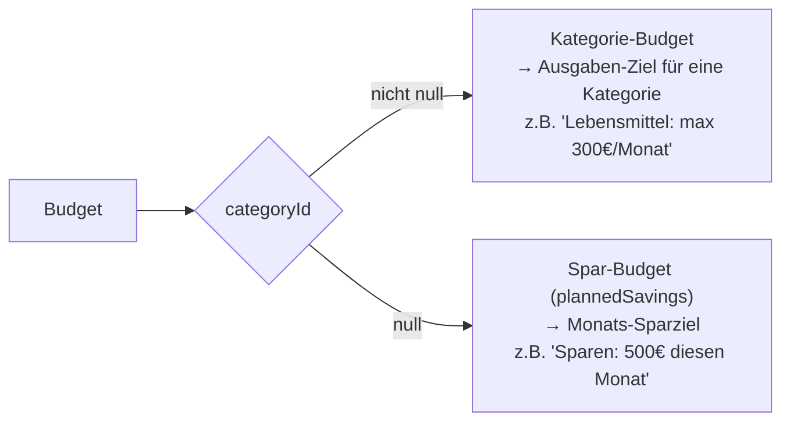

# Budgets — Ziele vs. tatsächliche Ausgaben

**Quellen:**
- `apps/web/app/api/budgets/route.ts`
- `apps/web/app/api/analytics/summary/route.ts` (Budget-Auswertung)
- `apps/web/app/api/budget-plans/` (Budget-Pläne), `apps/web/lib/categoryBudgets.ts`
- `packages/shared/src/budgetDistribution.ts` (Verteilung, Auflösung)

## Was ist ein Budget?

Ein Budget definiert einen **Ziel-Betrag** für eine Kategorie in einem bestimmten Monat.

```
Budget
├── accountId   — Konto
├── categoryId  — Kategorie (null = Spar-Budget)
├── month       — 1-12
├── year
├── amountCents — Ziel-Betrag (positiv)
└── title       — optionaler Titel (Default "")
```

**Unique-Constraint:** `(accountId, categoryId, month, year)` — pro Kategorie/Monat nur ein Budget.

## Zwei Budget-Typen


```mermaid
flowchart LR
    B["Budget"] --> CAT{categoryId}
    CAT -->|"nicht null"| CATBUDGET["Kategorie-Budget\n→ Ausgaben-Ziel für eine Kategorie\nz.B. 'Lebensmittel: max 300€/Monat'"]
    CAT -->|"null"| SAVBUDGET["Spar-Budget (plannedSavings)\n→ Monats-Sparziel\nz.B. 'Sparen: 500€ diesen Monat'"]
```

## Budget-Pläne (CategoryBudgetPlan)

Ein **Plan** ist ein dauerhaftes Budget je Kategorie (höchstens einer pro Kategorie, nicht für Spar- und Einnahmenkategorien):

- `MONTHLY` — `amountCents` gilt in jedem Monat.
- `YEARLY` — `amountCents` ist der Jahresbetrag und wird auf die 12 Monate verteilt.

**Verteilung (YEARLY)**, alles in Integer-Cent, Gewichte `w[i] = max(0, available[i])`, `available` = geglättete Verfügbarkeit (`smoothedAvailablePerMonth`): Jahreseinnahmen der Daueraufträge gleichmäßig `round(income.totalCents / 12)` plus die Fixkosten und Sparraten des jeweiligen Monats (`expenses`/`savings.monthlyTotalsCents[m]`):

```
W = Σ w[i]                         (W <= 0 → alle Gewichte 1, also gleichmäßig)
share[i] = floor(yearly * w[i] / W)
Rest r = yearly - Σ share[i]       (0..11 Cent)
→ der komplette Rest geht auf den Monat mit dem größten Gewicht (Gleichstand: kleinster Index)
```

Die Summe der 12 Monatsbeträge ist immer exakt `yearly`; Monate ohne Verfügbarkeit erhalten 0 (außer im Gleichgewichts-Fallback).

**Reihenfolge der effektiven Budgets** (`loadEffectiveCategoryBudgets`, `resolveEffectiveBudgets`):

1. Plan der Kategorie (MONTHLY: Betrag, YEARLY: Anteil des Monats)
2. Ein Monats-`Budget` (Konto, Kategorie, Monat, Jahr) überschreibt den Plan **nicht**: der Plan hat Vorrang
3. Ein Monats-`Budget` gilt nur als Fallback für Kategorien **ohne** Plan und wird dann unverändert übernommen
4. Kategorien ohne Plan und ohne Monats-Budget haben kein Budget

Pläne von soft-gelöschten Kategorien und soft-gelöschte Pläne werden ignoriert. Die Jahresmatrix wird nur geladen, wenn ein YEARLY-Plan existiert.

**Kategorie zusammenführen/löschen:** Beim Merge (`PATCH /api/categories/:id` mit `mergeIntoCategoryId`) und beim Löschen mit Fallback (`DELETE`, `fallbackCategoryId`/`fallbackName`) folgt der Plan der Quellkategorie in derselben Transaktion: Hat die Zielkategorie keinen aktiven Plan, wird der Quellplan (gleiche `id`) auf das Ziel umgehängt (eine soft-gelöschte Plan-Zeile des Ziels wird vorher hart gelöscht, da `categoryId` unique ist). Hat das Ziel einen aktiven Plan, bleibt dieser unverändert und der Quellplan wird hart gelöscht.

**Rückwirkend:** Pläne gelten ohne Gültigkeitsbeginn für alle Monate und Jahre, auch für abgeschlossene (Monatsrückblick). Ändert man einen Plan, ändern sich damit auch die Budgets vergangener Monate.

**Angebunden:** `GET /api/analytics/summary` (`categoryBudgets`, auch bei `spent = 0`) und `GET /api/analytics/monthly-review` (`budgetCents`; Kategorien nur mit Budget erscheinen mit `transactions: []`).

**Noch nicht angebunden:** Die Budgetwarnungen (`lib/budgetAlerts.ts`) arbeiten weiterhin auf dem alten Monats-`Budget`-Modell und kennen Pläne nicht.

## Budget-Auswertung im Dashboard

Im Summary-Endpoint wird pro Kategorie-Budget berechnet:

```typescript
// categoryBudgetsRaw: Record<categoryId, effektives Budget in Cent> (Plan hat Vorrang, Monats-Budget nur Fallback ohne Plan)
const categoryBudgets = Object.entries(categoryBudgetsRaw).map(([categoryId, budgetCents]) => {
  const spentCents = byCategoryCents[categoryId] ?? 0;
  return {
    categoryId,
    name: updatedNameMap[categoryId] ?? categoryId,
    budget: budgetCents / 100,
    spent: spentCents / 100,
    diff: (spentCents - budgetCents) / 100
  };
});
```

| Feld | Bedeutung |
|---|---|
| `budget` | Geplanter Betrag (Ziel) |
| `spent` | Tatsächliche Ausgaben + Dauerauftrags-Ausgaben dieser Kategorie |
| `diff` | `spent - budget`: positiv = über Budget, negativ = unter Budget |

**Was in `spent` einfließt:**
- Echte Transaktionen dieser Kategorie diesen Monat (nur Ausgaben, amountCents < 0)
- Aktive, nicht-geskippte Daueraufträge dieser Kategorie (`recurringByCategoryCents`)

## Spar-Budget (plannedSavings)

```typescript
const plannedBudgetAgg = await prisma.budget.aggregate({
  where: { accountId, categoryId: null, month, year },
  _sum: { amountCents: true }
});
const plannedSavings = (plannedBudgetAgg._sum.amountCents ?? 0) / 100;
```

- Aggregiert alle Budgets ohne Kategorie für den aktuellen Monat
- Obwohl der Unique-Constraint nur ein Budget ohne Kategorie pro Monat erlaubt, verwendet der Code `aggregate` (statt `findFirst`) — defensiv für zukünftige Erweiterungen
- Dieser Wert wird im Dashboard als Sparziel angezeigt, aber nicht mit `monthlySavingsActual` verrechnet

## API

| Methode | Endpoint | Beschreibung |
|---|---|---|
| GET | `/api/budgets` | Alle Budgets des Nutzers (neueste zuerst) |
| POST | `/api/budgets` | Neues Budget anlegen |

**POST-Body:**
```typescript
{
  accountId: string,
  categoryId?: string,  // fehlt = Spar-Budget
  month: number,        // 1-12
  year: number,
  amountCents: number   // Integer
}
```

## Oberfläche: Seite `/budgets`

Die Seite `/budgets` (Navigation: „Budgets") verwaltet die Budget-Pläne je Kategorie. Pro budgetierbarer Kategorie wählt man „Monatlich" oder „Jährlich" und gibt einen Betrag ein (Eingabe deutsch oder englisch, z. B. `1.234,56` oder `12.5`, geparst mit `parseMoneyInput` aus `@doewe/shared`). Bei „Jährlich" zeigt eine Vorschau die 12 Monatswerte; das Jahr (`?year=`) bestimmt die Verteilung, da sie vom monatlich verfügbaren Geld der Daueraufträge dieses Jahres abhängt. Speichern/Entfernen laufen über `/api/budget-plans`; danach werden Dashboard und Rückblick neu geladen.

## Oberfläche: Seite `/budgets`

Die Seite `/budgets` (Navigation: „Budgets") verwaltet die Budget-Pläne je Kategorie. Pro budgetierbarer Kategorie wählt man „Monatlich" oder „Jährlich" und gibt einen Betrag ein (Eingabe deutsch oder englisch, z. B. `1.234,56` oder `12.5`, geparst mit `parseMoneyInput` aus `@doewe/shared`). Bei „Jährlich" zeigt eine Vorschau die 12 Monatswerte; das Jahr (`?year=`) bestimmt die Verteilung, da sie vom monatlich verfügbaren Geld der Daueraufträge dieses Jahres abhängt. Speichern/Entfernen laufen über `/api/budget-plans`; danach werden Dashboard und Rückblick neu geladen.

## Jahresblick: Budget-Status je Kategorie und Monat

Die Seite `/yearly` zeigt die tatsächlichen Ausgaben je Kategorie und Monat (`GET /api/analytics/category-year`) gegen das effektive Monatsbudget (`loadEffectiveCategoryBudgetsForYear`: Plan vor altem Monats-`Budget`; ein altes Budget gilt nur in den Monaten, für die eine Zeile existiert, sonst gibt es dort kein Budget). Status je Monats- und Summenzelle (`data-budget-status`):

| Status | Bedingung |
|---|---|
| `over` | Ausgabe **strikt größer** als ein Budget > 0 (genau auf Budget ist nicht „über") |
| `warn` | nicht über, aber Ausgabe >= **85 %** des Budgets (`ausgabe * 100 >= budget * 85`, ganzzahlig) |
| `ok` | unter 85 % des Budgets |
| `none` | kein Budget (oder Budget 0) in dem Monat bzw. für die Kategorie |

Die Summenzelle vergleicht nur die Monate mit Budget gegen deren Budgetsumme (`overYear`); Ausgaben in Monaten ohne Budget zählen nicht. Farbe ist nie alleiniger Bedeutungsträger: `over`/`warn` tragen zusätzlich unsichtbaren Text für Screenreader, eine Legende erklärt die Farben.

## Hinweis: Budget-Modell wird auch für Sparpläne verwendet

Das `Budget`-Modell wird **doppelt genutzt**:

1. Als **Monatsbudget** (Kategorie-Budget): über `/api/budgets`
2. Als **Sparziel** (Saving Plan): über `/api/saving-plan`

Der Unterschied:
- Kategorie-Budget: `categoryId` gesetzt, `title` meist leer
- Sparziel: `categoryId = null`, `title` immer gesetzt, Datum = Ziel-Deadline

Siehe [07-sparziele.md](./07-sparziele.md) für die Sparziel-Logik.
