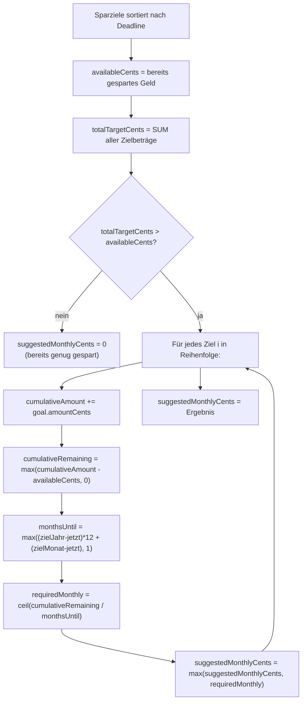

# Sparpläne und Sparziele

**Quelle:** `apps/web/app/api/saving-plan/route.ts`, `apps/web/app/api/saving-plan/[id]/route.ts`
**Endpoints:** `GET/POST /api/saving-plan`, `GET/PATCH/DELETE /api/saving-plan/[id]`

## Datenmodell

Sparziele verwenden das **Budget-Modell** mit `categoryId = null`:

```
Budget (als Sparziel)
├── categoryId  = null       — unterscheidet Sparziel von Kategorie-Budget
├── title                    — Pflichtfeld (z.B. "Urlaub 2027")
├── month       = Zielmonat  — wann das Ziel erreicht sein soll (1-12)
├── year        = Zielyahr
└── amountCents              — Ziel-Betrag in Cents (mind. 1)
```

## Verfügbares Spar-Guthaben (availableCents)

```typescript
async function resolveSavingsBalanceCents(accountId, userId) {
  const savingsCatId = await findSavingsCategoryId(userId);
  if (!savingsCatId) return 0;

  const savingsTransactions = await prisma.transaction.findMany({
    where: { accountId, categoryId: savingsCatId },
    select: { amountCents: true }
  });

  // Sparbuchungen sind negativ → negieren für positiven Saldo
  return savingsTransactions.reduce((total, tx) => total - tx.amountCents, 0);
}
```

**Wichtig:**
- Es werden **alle Sparbuchungen aller Zeiten** summiert, nicht nur diesen Monat
- Die Berechnung negiert die negativen `amountCents` → Ergebnis ist immer positiv (sofern nur Sparbuchungen)
- Eventuell gibt es auch positive Transaktionen in der Spar-Kategorie (z.B. Rückbuchungen) — diese würden den Saldo verringern
- Wenn keine Spar-Kategorie existiert: `availableCents = 0`

## Transaktionen verknüpft mit Sparzielen

```typescript
transactionSpentCents: goal.transactions.reduce(
  (sum, tx) => sum + Math.abs(tx.amountCents), 0
)
```

- `goal.transactions` = alle Transaktionen mit `savingGoalId = goal.id`
- Summiert den **absoluten Betrag** aller verknüpften Transaktionen
- Zeigt, wie viel bereits auf dieses Ziel eingezahlt wurde

## Empfohlene monatliche Sparrate (suggestedMonthlyCents)

Der Algorithmus berechnet den **kleinsten konstanten Monatsbetrag** X, mit dem alle Sparziele pünktlich erreicht werden können.

### Algorithmus

```
Für jedes Ziel i (sortiert nach Deadline):
  cumulativeAmount[i] = Summe der Zielbeträge von Ziel 1 bis i
  cumulativeRemaining[i] = max(cumulativeAmount[i] - availableCents, 0)
  monthsUntil[i] = max((year - currentYear)*12 + (month - currentMonth), 1)
  requiredMonthly[i] = ceil(cumulativeRemaining[i] / monthsUntil[i])

suggestedMonthlyCents = max(requiredMonthly[1..n])
```



### Beispiel

**Annahmen:**
- Aktuell: Juni 2026
- Verfügbares Guthaben: 1.000 € (100.000 Cents)
- Ziel 1: "Laptop" — 800 € bis September 2026 (3 Monate)
- Ziel 2: "Urlaub" — 1.500 € bis Dezember 2026 (6 Monate)

| Schritt | Wert |
|---|---|
| cumulativeAmount nach Ziel 1 | 80.000 Cents |
| cumulativeRemaining Ziel 1 | max(80.000 - 100.000, 0) = 0 (schon gedeckt) |
| requiredMonthly Ziel 1 | ceil(0 / 3) = 0 |
| cumulativeAmount nach Ziel 2 | 230.000 Cents |
| cumulativeRemaining Ziel 2 | max(230.000 - 100.000, 0) = 130.000 |
| requiredMonthly Ziel 2 | ceil(130.000 / 6) = 21.667 Cents = 216,67 € |
| **suggestedMonthlyCents** | **21.667 Cents ≈ 216,67 €** |

### Wichtige Details

- `monthsUntil` wird auf **mindestens 1** geclampt — Division durch 0 ausgeschlossen
- `Math.ceil()` — immer aufgerundet, kein Untersparen möglich
- `usedAvailable = availableCents` wird konstant gehalten — nicht für jedes Ziel erneut subtrahiert. Das bedeutet: Das Guthaben wird nur einmalig als "Puffer" betrachtet, nicht pro Ziel einzeln zugewiesen.

## API-Besonderheit: flexible Feldnamen

Die POST- und PATCH-Endpunkte akzeptieren mehrere Feldnamen für Monat/Jahr:

```typescript
// POST: targetMonth, month, dueMonth werden alle akzeptiert
targetMonth: json?.targetMonth ?? json?.month ?? json?.dueMonth

// PATCH: targetMonth, month
targetMonth: json?.targetMonth ?? json?.month
```

## Titel-Normalisierung

```typescript
function normalizeTitle({ title, categoryName, month, year }) {
  const trimmed = title?.trim();
  if (trimmed) return trimmed;          // 1. Expliziter Titel
  if (categoryName) return categoryName; // 2. Kategoriename als Fallback
  return `${year}-${String(month).padStart(2, "0")}`;  // 3. Datum als letzter Ausweg
}
```

Da Sparziele immer `categoryId = null` haben, ist `categoryName` immer `null` — der Fallback ist also immer das Datum-Format.

## GET /api/saving-plan — Response

```typescript
{
  goals: [
    {
      id: string,
      accountId: string,
      categoryId: null,
      categoryName: null,
      title: string,
      month: number,
      year: number,
      amountCents: number,
      transactionSpentCents: number,  // Abs-Summe verknüpfter Transaktionen
      createdAt: DateTime
    }
  ],
  totals: {
    availableCents: number,       // Verfügbares Spar-Guthaben (alle Zeiten)
    totalTargetCents: number,     // Summe aller Zielbeträge
    suggestedMonthlyCents: number // Empfohlene monatliche Sparrate
  }
}
```
