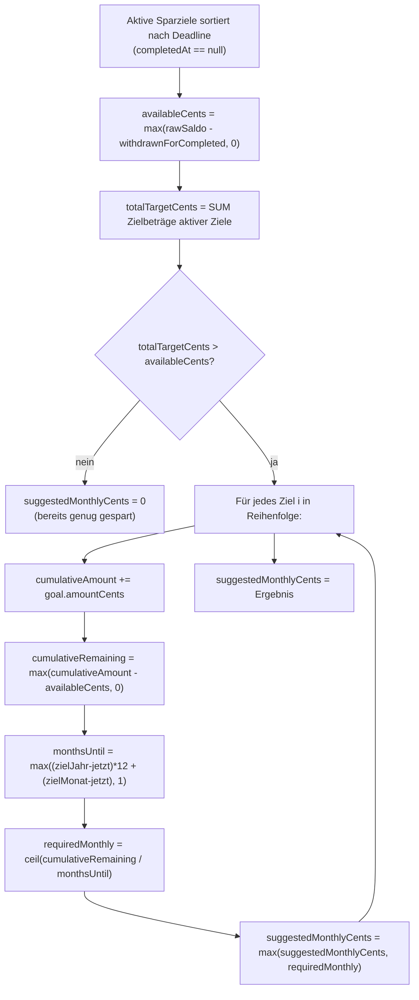

# Sparpläne und Sparziele

**Quelle:** `apps/web/app/api/saving-plan/route.ts`, `apps/web/app/api/saving-plan/[id]/route.ts`, `apps/web/app/api/saving-plan/[id]/complete/route.ts`, `apps/web/app/api/saving-plan/compute.ts`
**Endpoints:** `GET/POST /api/saving-plan`, `GET/PATCH/DELETE /api/saving-plan/[id]`, `POST/DELETE /api/saving-plan/[id]/complete`

## Datenmodell

Sparziele verwenden das **Budget-Modell** mit `categoryId = null`:

```
Budget (als Sparziel)
├── categoryId  = null       — unterscheidet Sparziel von Kategorie-Budget
├── title                    — Pflichtfeld (z.B. "Urlaub 2027")
├── month       = Zielmonat  — wann das Ziel erreicht sein soll (1-12)
├── year        = Zielyahr
├── amountCents              — Ziel-Betrag in Cents (mind. 1)
├── completedAt = null       — null = aktives Ziel, gesetzt = abgeschlossen
└── spentCents  = null       — beim Abschluss tatsächlich aus dem Spar-Topf
                                entnommener Betrag (Snapshot); null solange aktiv
```

Ein Ziel ist **aktiv**, solange `completedAt == null`. Sobald es abgeschlossen wird,
hält `spentCents` den Betrag fest, der dafür aus dem gemeinsamen Spar-Topf entnommen
wurde. Aktive und abgeschlossene Ziele werden in der GET-Response getrennt geliefert
(`goals` vs. `completedGoals`).

## Verfügbares Spar-Guthaben (rawAvailableCents → availableCents)

### Schritt 1: Roher Spar-Saldo (rawAvailableCents)

`resolveSavingsBalanceCents` in `route.ts` ermittelt den rohen Spar-Saldo aus den
Transaktionen der Spar-Kategorie:

```typescript
async function resolveSavingsBalanceCents(accountId, userId) {
  const savingsCatId = await findSavingsCategoryId(userId);
  if (!savingsCatId) return 0;

  const savingsTransactions = await prisma.transaction.findMany({
    where: { accountId, categoryId: savingsCatId },
    select: { amountCents: true }
  });

  // Sparbuchungen sind negativ → negieren für positiven Saldo
  return savingsTransactions.reduce((total, tx) => total - tx.amountCents, 0);
}
```

**Wichtig:**
- Es werden **alle Sparbuchungen aller Zeiten** summiert, nicht nur diesen Monat
- Die Berechnung negiert die negativen `amountCents` → Ergebnis ist immer positiv (sofern nur Sparbuchungen)
- Eventuell gibt es auch positive Transaktionen in der Spar-Kategorie (z.B. Rückbuchungen) — diese würden den Saldo verringern
- Wenn keine Spar-Kategorie existiert: `rawAvailableCents = 0`

Dieser Wert wird in den Totals als `rawAvailableCents` ausgewiesen.

### Schritt 2: Reservierung für abgeschlossene Ziele (availableCents)

Der eigentliche Topf für die verbleibenden **aktiven** Ziele wird in der reinen Funktion
`computeSavingPlanTotals` (`compute.ts`) berechnet. Abgeschlossene Ziele reservieren
ihren bei Abschluss entnommenen Betrag (`spentCents`) aus dem rohen Saldo:

```typescript
const withdrawnForCompletedCents = goals
  .filter(isCompleted)                         // completedAt != null
  .reduce((sum, goal) => sum + (goal.spentCents ?? 0), 0);

const availableCents = Math.max(rawSavingsBalance - withdrawnForCompletedCents, 0);
```

**Wichtig:**
- `withdrawnForCompletedCents` = Summe `spentCents` **aller abgeschlossenen Ziele**
- `availableCents` = `max(rawAvailableCents − withdrawnForCompletedCents, 0)` — der bei 0
  geklammerte Topf, der den **aktiven** Zielen zur Verfügung steht
- Der Abschluss eines Ziels reduziert nur diesen rechnerischen Topf — siehe Abschnitt
  "Completion-Lebenszyklus" zur Buchungs-Konvention

## Transaktionen verknüpft mit Sparzielen

```typescript
transactionSpentCents: goal.transactions.reduce(
  (sum, tx) => sum + Math.abs(tx.amountCents), 0
)
```

- `goal.transactions` = alle Transaktionen mit `savingGoalId = goal.id`
- Summiert den **absoluten Betrag** aller verknüpften Transaktionen
- Zeigt, wie viel bereits auf dieses Ziel eingezahlt wurde

## Zielsumme (totalTargetCents)

```typescript
const totalTargetCents = activeGoals.reduce((sum, goal) => sum + goal.amountCents, 0);
```

`totalTargetCents` summiert nur die `amountCents` der **aktiven** Ziele
(`completedAt == null`). Abgeschlossene Ziele zählen nicht mehr zur offenen Zielsumme.

## Empfohlene monatliche Sparrate (suggestedMonthlyCents)

Der Algorithmus berechnet den **kleinsten konstanten Monatsbetrag** X, mit dem alle
**aktiven** Sparziele pünktlich erreicht werden können. Die Schleife läuft ausschließlich
über die aktiven Ziele und nutzt den um die abgeschlossenen Ziele bereinigten
`availableCents` als Puffer.

### Algorithmus

```
Für jedes Ziel i (sortiert nach Deadline):
  cumulativeAmount[i] = Summe der Zielbeträge von Ziel 1 bis i
  cumulativeRemaining[i] = max(cumulativeAmount[i] - availableCents, 0)
  monthsUntil[i] = max((year - currentYear)*12 + (month - currentMonth), 1)
  requiredMonthly[i] = ceil(cumulativeRemaining[i] / monthsUntil[i])

suggestedMonthlyCents = max(requiredMonthly[1..n])
```


```mermaid
flowchart TD
    A["Aktive Sparziele sortiert nach Deadline\n(completedAt == null)"] --> B
    B["availableCents = max(rawSaldo - withdrawnForCompleted, 0)"] --> C
    C["totalTargetCents = SUM Zielbeträge aktiver Ziele"] --> D
    D{totalTargetCents > availableCents?}
    D -->|nein| ZERO["suggestedMonthlyCents = 0\n(bereits genug gespart)"]
    D -->|ja| LOOP["Für jedes Ziel i in Reihenfolge:"]
    LOOP --> CUM["cumulativeAmount += goal.amountCents"]
    CUM --> REM["cumulativeRemaining = max(cumulativeAmount - availableCents, 0)"]
    REM --> MONTHS["monthsUntil = max((zielJahr-jetzt)*12 + (zielMonat-jetzt), 1)"]
    MONTHS --> REQ["requiredMonthly = ceil(cumulativeRemaining / monthsUntil)"]
    REQ --> MAX["suggestedMonthlyCents = max(suggestedMonthlyCents, requiredMonthly)"]
    MAX --> LOOP
    LOOP --> DONE["suggestedMonthlyCents = Ergebnis"]
```

### Beispiel

**Annahmen:**
- Aktuell: Juni 2026
- Keine abgeschlossenen Ziele → `availableCents == rawAvailableCents`
- Verfügbares Guthaben (`availableCents`): 1.000 € (100.000 Cents)
- Ziel 1: "Laptop" — 800 € bis September 2026 (3 Monate), aktiv
- Ziel 2: "Urlaub" — 1.500 € bis Dezember 2026 (6 Monate), aktiv

| Schritt | Wert |
|---|---|
| cumulativeAmount nach Ziel 1 | 80.000 Cents |
| cumulativeRemaining Ziel 1 | max(80.000 - 100.000, 0) = 0 (schon gedeckt) |
| requiredMonthly Ziel 1 | ceil(0 / 3) = 0 |
| cumulativeAmount nach Ziel 2 | 230.000 Cents |
| cumulativeRemaining Ziel 2 | max(230.000 - 100.000, 0) = 130.000 |
| requiredMonthly Ziel 2 | ceil(130.000 / 6) = 21.667 Cents = 216,67 € |
| **suggestedMonthlyCents** | **21.667 Cents ≈ 216,67 €** |

### Wichtige Details

- `monthsUntil` wird auf **mindestens 1** geclampt — Division durch 0 ausgeschlossen
- `Math.ceil()` — immer aufgerundet, kein Untersparen möglich
- `usedAvailable = availableCents` wird konstant gehalten — nicht für jedes Ziel erneut subtrahiert. Das bedeutet: Das Guthaben wird nur einmalig als "Puffer" betrachtet, nicht pro Ziel einzeln zugewiesen.

## API-Besonderheit: flexible Feldnamen

Die POST- und PATCH-Endpunkte akzeptieren mehrere Feldnamen für Monat/Jahr:

```typescript
// POST: targetMonth, month, dueMonth werden alle akzeptiert
targetMonth: json?.targetMonth ?? json?.month ?? json?.dueMonth

// PATCH: targetMonth, month
targetMonth: json?.targetMonth ?? json?.month
```

## Titel-Normalisierung

```typescript
function normalizeTitle({ title, categoryName, month, year }) {
  const trimmed = title?.trim();
  if (trimmed) return trimmed;          // 1. Expliziter Titel
  if (categoryName) return categoryName; // 2. Kategoriename als Fallback
  return `${year}-${String(month).padStart(2, "0")}`;  // 3. Datum als letzter Ausweg
}
```

Da Sparziele immer `categoryId = null` haben, ist `categoryName` immer `null` — der Fallback ist also immer das Datum-Format.

## GET /api/saving-plan — Response

```typescript
{
  goals: [                          // NUR aktive Ziele (completedAt == null)
    {
      id: string,
      accountId: string,
      categoryId: null,
      categoryName: null,
      title: string,
      month: number,
      year: number,
      amountCents: number,
      transactionSpentCents: number,  // Abs-Summe verknüpfter Transaktionen
      completedAt: null,              // bei aktiven Zielen immer null
      spentCents: null,               // bei aktiven Zielen immer null
      createdAt: DateTime
    }
  ],
  completedGoals: [                 // abgeschlossene Ziele (completedAt != null), gleiche Felder
    {
      id: string,
      accountId: string,
      categoryId: null,
      categoryName: null,
      title: string,
      month: number,
      year: number,
      amountCents: number,
      transactionSpentCents: number,
      completedAt: DateTime,          // Abschluss-Zeitpunkt
      spentCents: number,             // bei Abschluss entnommener Betrag (Snapshot)
      createdAt: DateTime
    }
  ],
  totals: {
    rawAvailableCents: number,          // roher Spar-Saldo (vor Reservierung)
    withdrawnForCompletedCents: number, // SUM spentCents aller abgeschlossenen Ziele
    availableCents: number,             // max(rawAvailableCents - withdrawnForCompleted, 0)
    totalTargetCents: number,           // Summe der Zielbeträge NUR aktiver Ziele
    suggestedMonthlyCents: number       // Empfohlene Monatsrate (nur aktive Ziele)
  }
}
```

## Completion-Lebenszyklus

Ein Sparziel durchläuft zwei Zustände: **aktiv** (`completedAt == null`) und
**abgeschlossen** (`completedAt` gesetzt). Der Übergang erfolgt über die dedizierte
Route `POST/DELETE /api/saving-plan/[id]/complete`.

### Abschließen — `POST /api/saving-plan/[id]/complete`

- **Body (Zod):** `{ spentCents: number }` — Integer `>= 0`, der tatsächlich aus dem
  Spar-Topf entnommene Betrag
- **Wirkung:** `completedAt = now`, `spentCents = <Body>`
- **Guards:** Auth (`401` ohne Session), Existenz (`404` Goal not found),
  Ownership (`403` Forbidden), Validierung (`400` bei ungültigem Body)
- **Response:** `{ id, completedAt, spentCents }`

### Wiedereröffnen — `DELETE /api/saving-plan/[id]/complete`

- **Wirkung:** `completedAt = null`, `spentCents = null` — das Ziel ist wieder aktiv
- **Guards:** identisch (Auth, Existenz, Ownership)
- **Response:** `{ id, completedAt, spentCents }`

### Buchungs-Konvention (wichtig)

Der Abschluss erzeugt **keine echte Transaktion**. Der `spentCents`-Abzug ist eine
reine Berechnung in der Sparplan-API:

- Der **rohe Spar-Saldo** (`rawAvailableCents`, abgeleitet aus den Transaktionen der
  Spar-Kategorie) bleibt durch den Abschluss **unverändert**.
- Lediglich `availableCents` (der Topf für die aktiven Ziele) sinkt rechnerisch um den
  reservierten `spentCents`-Betrag.
- Der **echte Kontostand** sinkt nur, wenn die Ausgabe **separat als Transaktion**
  gebucht wird — der Abschluss allein bewegt kein Geld.

### Auswirkungen auf andere Endpunkte

- `GET /api/analytics/summary`: `plannedSavings` zählt nur noch Ziele mit
  `completedAt == null` — abgeschlossene Ziele sind keine geplante Ersparnis mehr.
  Zusätzlich liefert die Route `completedGoals` (im **aktuellen** Monat abgeschlossene
  Ziele, je `{ title, target, spent, completedAt }`, Euro) und `completedGoalsSpent`
  für die Dashboard-Anzeige.
- `GET /api/analytics/monthly-review`: liefert `completedGoals[]` (im abgefragten Monat
  abgeschlossene Ziele, je `{ title, amountCents, spentCents }`) und die Summe
  `completedGoalsSpentCents`.
