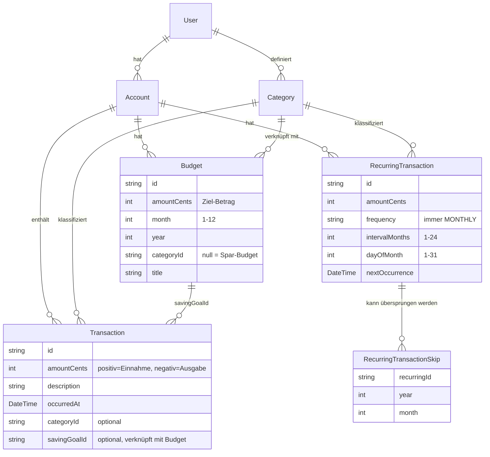

# Doewe — Berechnungsdokumentation

Diese Dokumentation beschreibt alle Berechnungslogiken und Datenflüsse der Doewe Finance-Plattform.
Sie dient sowohl als Referenz für Entwickler als auch als Wissensbasis für Claude-Tools.

## Inhalt

| Datei | Thema |
|---|---|
| [01-geld-cents.md](./01-geld-cents.md) | Cents-System, Geldtypen, Parsing und Arithmetik |
| [02-transaktionen.md](./02-transaktionen.md) | Transaktionsklassifizierung (Einnahme / Ausgabe / Sparen) |
| [03-wiederkehrende-transaktionen.md](./03-wiederkehrende-transaktionen.md) | Dauerauftrags-Scheduling, Fälligkeitsberechnung, Skips |
| [04-analytics-summary.md](./04-analytics-summary.md) | Monatliche Zusammenfassung — alle Dashboard-Kennzahlen |
| [05-analytics-quarterly.md](./05-analytics-quarterly.md) | Quartalübersicht — letzte 3 Monate |
| [06-budgets.md](./06-budgets.md) | Budget-Ziele vs. tatsächliche Ausgaben |
| [07-sparziele.md](./07-sparziele.md) | Sparpläne, verfügbares Guthaben, empfohlene Monatsrate |

## Kernprinzipien

1. **Alle Beträge intern in Cents (Integer)** — niemals Floating-Point-Arithmetik für Geld.
2. **Positiv = Einnahme, Negativ = Ausgabe** — gilt für `amountCents` in allen Modellen.
3. **Spar-Kategorie ist separat** — Buchungen mit der "savings"/"sparen"-Kategorie werden aus Ausgaben herausgerechnet.
4. **Daueraufträge sind nur Vorlagen** — sie werden nicht automatisch als echte Transaktionen gebucht, sondern als "geplant" in Analytics eingerechnet.
5. **Nur ein Konto pro Nutzer** — Multi-Account-Aggregation ist noch nicht implementiert.

## Datenmodell-Übersicht

