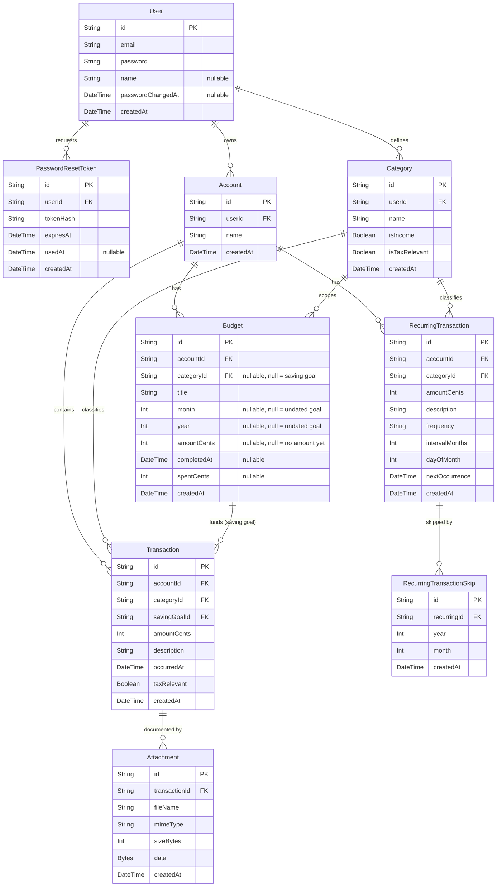

# Doewe — Data Model

## Entity-Relationship Diagram


```mermaid
erDiagram
    User {
        String id PK
        String email
        String password
        String name "nullable"
        DateTime passwordChangedAt "nullable"
        DateTime createdAt
    }
    PasswordResetToken {
        String id PK
        String userId FK
        String tokenHash
        DateTime expiresAt
        DateTime usedAt "nullable"
        DateTime createdAt
    }
    Account {
        String id PK
        String userId FK
        String name
        DateTime createdAt
    }
    Category {
        String id PK
        String userId FK
        String name
        Boolean isIncome
        Boolean isTaxRelevant
        DateTime createdAt
    }
    Transaction {
        String id PK
        String accountId FK
        String categoryId FK
        String savingGoalId FK
        Int amountCents
        String description
        DateTime occurredAt
        Boolean taxRelevant
        DateTime createdAt
    }
    Attachment {
        String id PK
        String transactionId FK
        String fileName
        String mimeType
        Int sizeBytes
        Bytes data
        DateTime createdAt
    }
    RecurringTransaction {
        String id PK
        String accountId FK
        String categoryId FK
        Int amountCents
        String description
        String frequency
        Int intervalMonths
        Int dayOfMonth
        DateTime nextOccurrence
        DateTime createdAt
    }
    RecurringTransactionSkip {
        String id PK
        String recurringId FK
        Int year
        Int month
        DateTime createdAt
    }
    Budget {
        String id PK
        String accountId FK
        String categoryId FK "nullable, null = saving goal"
        String title
        Int month "nullable, null = undated goal"
        Int year "nullable, null = undated goal"
        Int amountCents "nullable, null = no amount yet"
        DateTime completedAt "nullable"
        Int spentCents "nullable"
        DateTime createdAt
    }

    User ||--o{ Account : "owns"
    User ||--o{ Category : "defines"
    User ||--o{ PasswordResetToken : "requests"
    Account ||--o{ Transaction : "contains"
    Account ||--o{ RecurringTransaction : "has"
    Account ||--o{ Budget : "has"
    Category ||--o{ Transaction : "classifies"
    Category ||--o{ RecurringTransaction : "classifies"
    Category ||--o{ Budget : "scopes"
    RecurringTransaction ||--o{ RecurringTransactionSkip : "skipped by"
    Budget ||--o{ Transaction : "funds (saving goal)"
    Transaction ||--o{ Attachment : "documented by"
```

> There is **no separate `SavingGoal` model** — a saving goal is a `Budget` row
> with `categoryId = null`. See the Budget section below.

---

## Entity Descriptions

### User

Represents an authenticated person using the application. Every piece of data in the system is owned by a user — either directly (categories) or transitively through accounts.

| Field | Type | Description |
|---|---|---|
| `id` | String (CUID) | Primary key, generated by Prisma |
| `email` | String | Unique login identifier |
| `password` | String | bcrypt hash of the password; never exposed via API |
| `name` | String? | Optional display name |
| `passwordChangedAt` | DateTime? | Bumped on every password change/reset. JWTs issued before this instant are treated as stale and rejected, so a reset evicts existing sessions |
| `createdAt` | DateTime | Account creation timestamp |

**Relationships:** A user owns multiple `Account`s, multiple `Category`s, and multiple `PasswordResetToken`s.

**Constraints:** `email` is unique across all users.

---

### PasswordResetToken

One-time token for the "forgot password" flow. Only the SHA-256 hash of the token is stored — the plaintext lives solely in the emailed reset link.

| Field | Type | Description |
|---|---|---|
| `id` | String (CUID) | Primary key |
| `userId` | String | FK → User.id (`onDelete: Cascade`) |
| `tokenHash` | String | SHA-256 hash of the token; unique |
| `expiresAt` | DateTime | Expiry timestamp |
| `usedAt` | DateTime? | Set once the token has been redeemed |
| `createdAt` | DateTime | Creation timestamp |

---

### Account

A financial account owned by a user, analogous to a bank account or cash wallet. All transactions, recurring transactions, budgets, and saving goals belong to an account, which ties them back to the user.

| Field | Type | Description |
|---|---|---|
| `id` | String (CUID) | Primary key |
| `userId` | String | FK → User.id |
| `name` | String | Human-readable label (e.g., "Girokonto", "Bargeld") |
| `createdAt` | DateTime | Creation timestamp |

**Relationships:** An account belongs to exactly one `User` (`onDelete: Cascade` — deleting the user also deletes their accounts). It has many `Transaction`s, `RecurringTransaction`s, and `Budget`s. (Saving goals are `Budget` rows with `categoryId = null`; there is no separate `SavingGoal` model.)

---

### Category

A user-defined label used to classify transactions and recurring transactions. Categories are also the unit of budgeting — a budget is tied to one category for one month.

| Field | Type | Description |
|---|---|---|
| `id` | String (CUID) | Primary key |
| `userId` | String | FK → User.id |
| `name` | String | Label (e.g., "Lebensmittel", "Miete", "Gehalt") |
| `isIncome` | Boolean | `true` for income categories, `false` for expense categories |
| `isTaxRelevant` | Boolean | Default `false`. When set, choosing this category in the transaction form pre-enables the tax toggle (user can override) |
| `createdAt` | DateTime | Creation timestamp |

**Relationships:** A category belongs to one `User`. It can classify many `Transaction`s, `RecurringTransaction`s, and `Budget`s.

**Constraints:** `(userId, name)` is unique — a user cannot have two categories with the same name.

**Special convention:** Categories whose `name` matches `"savings"` or `"sparen"` (case-insensitive) are treated as savings categories by the analytics engine. See Domain Rules below.

---

### Transaction

A single, one-time financial event: money coming in or going out on a specific date.

| Field | Type | Description |
|---|---|---|
| `id` | String (CUID) | Primary key |
| `accountId` | String | FK → Account.id |
| `categoryId` | String? | FK → Category.id (optional) |
| `savingGoalId` | String? | FK → Budget.id (optional) — points to a saving goal (a `Budget` with `categoryId = null`); `onDelete: SetNull` |
| `amountCents` | Int | Monetary value in euro cents; positive = income, negative = expense |
| `description` | String | Free-text note |
| `occurredAt` | DateTime | When the money moved (user-specified date) |
| `taxRelevant` | Boolean | Default `false`. Earmarks the transaction for the German tax return; the `/tax` page lists all flagged transactions per year |
| `createdAt` | DateTime | Record creation timestamp |

**Relationships:** Belongs to one `Account`. Optionally classified by one `Category`. Optionally linked to one saving goal (`Budget`). Has many `Attachment`s (receipts).

**Key rule:** `amountCents` carries the sign. A grocery purchase of €42.50 is stored as `-4250`. A salary of €3 200 is stored as `320000`.

---

### Attachment

A receipt file (photo or PDF) attached to a transaction as evidence for the tax return (Belegvorhaltepflicht — receipts are archived, not submitted to the tax office). The file bytes are stored directly in PostgreSQL.

| Field | Type | Description |
|---|---|---|
| `id` | String (CUID) | Primary key |
| `transactionId` | String | FK → Transaction.id; `onDelete: Cascade` — deleting the transaction removes its receipts |
| `fileName` | String | Sanitized original file name |
| `mimeType` | String | One of `image/jpeg`, `image/png`, `image/webp`, `application/pdf` (enforced in the API) |
| `sizeBytes` | Int | File size; max. 5 MB (enforced in the API) |
| `data` | Bytes | Raw file content. **Never selected in list queries** — only `GET /api/attachments/[id]` loads it |
| `createdAt` | DateTime | Upload timestamp |

**Constraints:** Max. 5 attachments per transaction (enforced in the API). Indexed on `transactionId`.

---

### RecurringTransaction

A template for a transaction that repeats on a schedule (e.g., monthly rent, quarterly insurance premium). The system uses it to project future cash flow and to display "expected" entries in the monthly summary.

| Field | Type | Description |
|---|---|---|
| `id` | String (CUID) | Primary key |
| `accountId` | String | FK → Account.id |
| `categoryId` | String? | FK → Category.id (optional) |
| `amountCents` | Int | Amount per occurrence (same sign convention as Transaction) |
| `description` | String | Label (e.g., "Miete", "Netflix") |
| `frequency` | String | Uppercase frequency identifier — allowed values per schema comment: `DAILY \| WEEKLY \| MONTHLY \| YEARLY` (validated in the API). The create endpoint currently always sets `"MONTHLY"`; the actual cadence is driven by `intervalMonths` |
| `intervalMonths` | Int | Number of months between occurrences (e.g., `1` for monthly, `3` for quarterly) |
| `dayOfMonth` | Int | Which day of the month the payment falls on (1–31) |
| `nextOccurrence` | DateTime | Computed date of the next expected occurrence |
| `createdAt` | DateTime | Creation timestamp |

**Relationships:** Belongs to one `Account`. Optionally classified by one `Category`. Has many `RecurringTransactionSkip`s for months the user chooses to skip.

---

### RecurringTransactionSkip

Records a deliberate skip of a recurring transaction for a specific calendar month. If a skip record exists for a `(recurringId, year, month)` combination, that month's occurrence is suppressed in the analytics.

| Field | Type | Description |
|---|---|---|
| `id` | String (CUID) | Primary key |
| `recurringId` | String | FK → RecurringTransaction.id (`onDelete: Cascade` — deleting the recurring transaction removes its skips) |
| `year` | Int | Calendar year of the skipped occurrence (e.g., `2026`) |
| `month` | Int | Calendar month of the skipped occurrence (1–12) |
| `createdAt` | DateTime | Creation timestamp |

**Constraints:** `(recurringId, year, month)` is unique — you can only skip a given occurrence once. There is an index on `recurringId`.

---

### Budget

A spending limit set by the user for a specific category in a specific calendar month — **or**, with `categoryId = null`, a saving goal.

| Field | Type | Description |
|---|---|---|
| `id` | String (CUID) | Primary key |
| `accountId` | String | FK → Account.id |
| `categoryId` | String? | FK → Category.id; `null` = the row is a saving goal, not a category budget |
| `title` | String | Display label (defaults to `""`); serves as the goal name for saving goals |
| `month` | Int? | Calendar month (1–12). Category budgets always set it; `null` on a saving goal = undated goal (idea backlog) |
| `year` | Int? | Calendar year; `null` on a saving goal = undated goal |
| `amountCents` | Int? | Budget limit / goal target in euro cents (positive). Required for category budgets; `null` on a saving goal = no target amount set yet |
| `completedAt` | DateTime? | `null` = active; set = goal closed. Only meaningful for saving goals (`categoryId = null`) |
| `spentCents` | Int? | Amount actually withdrawn from the savings pool on completion (snapshot); `null` while active |
| `createdAt` | DateTime | Creation timestamp |

**Constraints:** `(accountId, categoryId, month, year)` is unique — only one budget per category per month per account.

**Relationships:** Belongs to one `Account`. Optionally scoped to one `Category`. Has many `Transaction`s linked via `Transaction.savingGoalId` (contributions to a saving goal).

**Saving-goal lifecycle:** A `Budget` with `categoryId = null` acts as a saving goal. Setting `completedAt`/`spentCents` (via `POST /api/saving-plan/[id]/complete`) marks the goal as completed; clearing them (via `DELETE`) reopens it. Completing a goal does **not** create a transaction — it only reserves `spentCents` out of the computed savings pool that funds the remaining active goals. See `docs/calculations/07-sparziele.md`.

---

### Saving goals (no separate model)

There is no standalone `SavingGoal` model. A saving goal is a `Budget` record with `categoryId = null`:

- `title` serves as the goal name (e.g., "Urlaub 2027", "Neues Fahrrad").
- `amountCents` is the target amount (optional — `null` = no amount decided yet).
- `month`/`year` form the target date (both `null` = undated goal / idea backlog, excluded from the forward-looking savings plan).
- Transactions are linked to a goal via `Transaction.savingGoalId → Budget.id`.

See the Budget section above and `docs/calculations/07-sparziele.md` for the full lifecycle.

---

## Domain Rules

### Cents convention

All monetary values are stored as integer euro cents in the database, and all arithmetic happens on integer cents. Note that the **analytics endpoints divide by 100 at the final JSON output step** — their responses contain euro values (e.g., `income: 3200`), not cents. The CRUD endpoints (transactions, budgets, …) accept and return integer cents.

The `@doewe/shared` package exports a branded `Cents` type to prevent accidentally mixing raw numbers with cent values:

```typescript
// packages/shared/src/money.ts
type Cents = number & { readonly __brand: "Cents" };

function parseCents(input: string): Cents        // user input string ("12,50") → Cents
function fromCents(n: number): Cents             // raw DB integer → branded Cents
function toDecimalString(c: Cents): string       // display, e.g., "42.50"
function add(a: Cents, b: Cents): Cents
function sub(a: Cents, b: Cents): Cents
function multiply(a: Cents, factor: number): Cents
```

**Rule:** Never do arithmetic on raw `number` values that represent money. Always use the `Cents` helpers.

### Sign convention

```
amountCents > 0  →  income  (Einnahme)
amountCents < 0  →  expense (Ausgabe)
amountCents = 0  →  not allowed in practice
```

The analytics endpoints exploit this: `SUM(amountCents) WHERE amountCents > 0` gives total income; `SUM(amountCents) WHERE amountCents < 0` gives total expenses. Account balance is `SUM(amountCents)` across all transactions.

The UI is responsible for negating user-entered amounts when the user specifies an expense. The API receives the correctly-signed cent value.

### Savings category detection

The analytics engine identifies savings transactions by checking whether the associated category name matches the pattern `"savings"` or `"sparen"` (case-insensitive). There is no dedicated boolean flag or separate model. This means:

- A transaction categorized under "Sparen" or "savings" contributes to the savings total, not the expense total, in the monthly summary.
- Renaming the category to anything else will exclude those transactions from the savings calculation.
- The convention applies to both one-time transactions and recurring transactions.

---

## Example Data

The following illustrates a realistic snapshot of one user's data.

### User

| id | email |
|---|---|
| `usr_01` | `anna@example.de` |

### Accounts

| id | userId | name |
|---|---|---|
| `acc_01` | `usr_01` | Girokonto |
| `acc_02` | `usr_01` | Tagesgeldkonto |

### Categories

| id | userId | name | isIncome |
|---|---|---|---|
| `cat_01` | `usr_01` | Gehalt | true |
| `cat_02` | `usr_01` | Lebensmittel | false |
| `cat_03` | `usr_01` | Miete | false |
| `cat_04` | `usr_01` | Sparen | false |
| `cat_05` | `usr_01` | Freizeit | false |

### Transactions (April 2026)

| id | accountId | categoryId | amountCents | description | occurredAt |
|---|---|---|---|---|---|
| `txn_01` | `acc_01` | `cat_01` | `320000` | Gehalt April | 2026-04-01 |
| `txn_02` | `acc_01` | `cat_03` | `-85000` | Miete April | 2026-04-02 |
| `txn_03` | `acc_01` | `cat_02` | `-6340` | Rewe | 2026-04-05 |
| `txn_04` | `acc_01` | `cat_04` | `-50000` | Monatliche Sparrate | 2026-04-10 |
| `txn_05` | `acc_01` | `cat_05` | `-2800` | Kino | 2026-04-18 |

### RecurringTransactions

| id | accountId | categoryId | amountCents | description | intervalMonths | dayOfMonth | nextOccurrence |
|---|---|---|---|---|---|---|---|
| `rec_01` | `acc_01` | `cat_03` | `-85000` | Miete | 1 | 1 | 2026-05-01 |
| `rec_02` | `acc_01` | `cat_04` | `-50000` | Sparrate | 1 | 10 | 2026-05-10 |

### RecurringTransactionSkips

(No skips in this example — Anna pays everything in May.)

### Budgets (April 2026)

| id | accountId | categoryId | title | month | year | amountCents |
|---|---|---|---|---|---|---|
| `bud_01` | `acc_01` | `cat_02` | Lebensmittel | 4 | 2026 | `20000` |
| `bud_02` | `acc_01` | `cat_05` | Freizeit | 4 | 2026 | `5000` |

### Computed Dashboard Numbers (April 2026)

| Metric | Calculation | Result |
|---|---|---|
| Income | `SUM(amountCents > 0)` | €3 200.00 |
| Expenses | `ABS(SUM(amountCents < 0, non-savings))` | €941.40 |
| Savings | `ABS(SUM(amountCents, category=Sparen))` | €500.00 |
| Lebensmittel actual vs budget | €63.40 vs €200.00 | 31.7% used |
| Freizeit actual vs budget | €28.00 vs €50.00 | 56.0% used |
