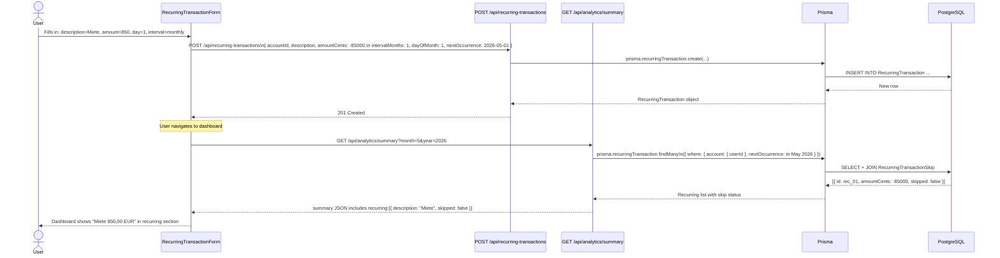
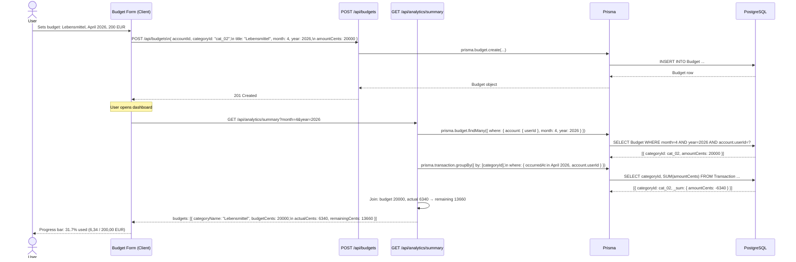
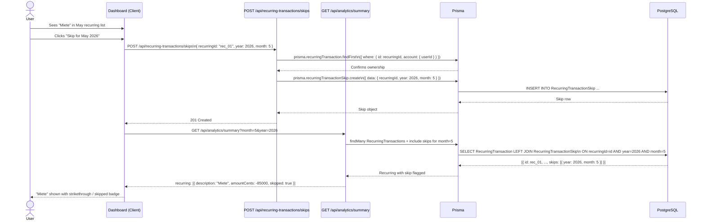
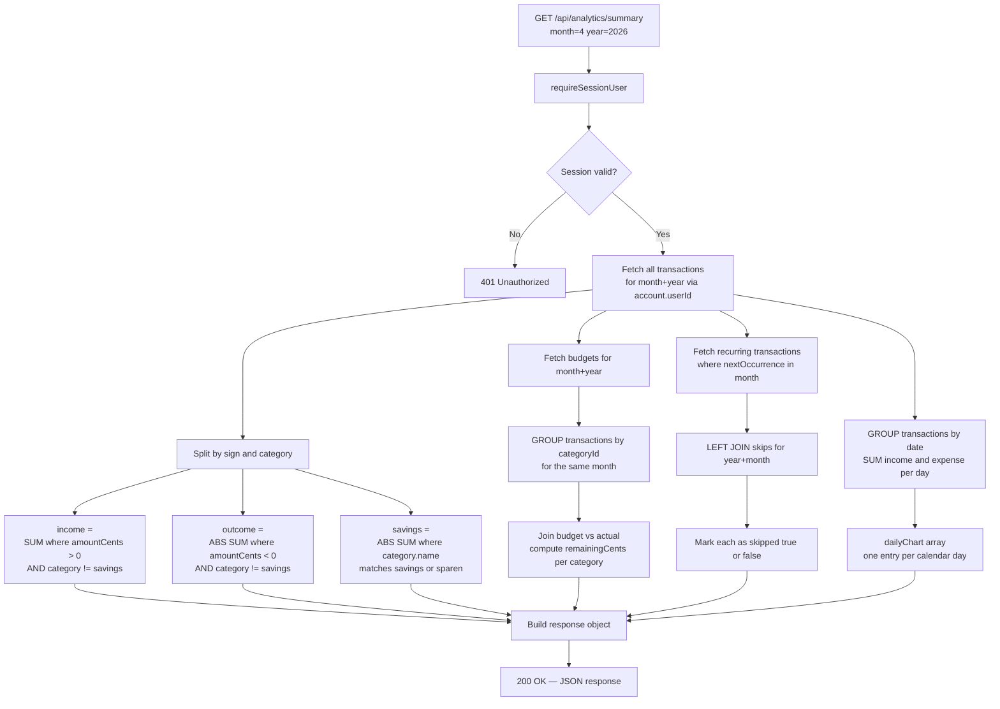

# Doewe — User Flows

This document describes the five core user flows with sequence diagrams and explanatory notes.

---

## Flow 1: Transaction Entry

A user adds a new expense transaction via the transaction form.

```mermaid
sequenceDiagram
    actor User
    participant UI as TransactionForm (Client)
    participant Shared as @doewe/shared
    participant API as POST /api/transactions
    participant Auth as requireSessionUser()
    participant Zod as transactionSchema (Zod)
    participant ORM as Prisma
    participant DB as PostgreSQL

    User->>UI: Opens TransactionForm modal
    User->>UI: Enters: amount=42.50, description=Rewe, category=Lebensmittel, date=today

    UI->>Shared: parseCents("42.50") → -4250 (expense, negated by UI)
    UI->>API: POST /api/transactions\nbody: { accountId, categoryId, amountCents: -4250, description, occurredAt }

    API->>Auth: getSessionUser(request)
    Auth-->>API: { id: "usr_01", email: "anna@example.de" }

    API->>Zod: transactionSchema.parse(body)
    Zod-->>API: Validated payload

    API->>ORM: prisma.account.findFirst({ where: { id: accountId, userId } })
    ORM->>DB: SELECT * FROM Account WHERE id=? AND userId=?
    DB-->>ORM: Account row
    ORM-->>API: Account confirmed

    API->>ORM: prisma.transaction.create({ data: validatedPayload })
    ORM->>DB: INSERT INTO Transaction ...
    DB-->>ORM: New Transaction row
    ORM-->>API: Transaction object

    API-->>UI: 201 Created + Transaction JSON

    UI->>UI: router.refresh() — invalidates Server Component cache
    UI-->>User: Transaction appears in list; modal closes
```

The UI negates the user-entered amount (42.50 becomes −4250 cents) before sending, because the API stores expenses as negative values. The auth check happens before any database access — if the session is missing, the request never touches Prisma. After the API returns 201, the Next.js `router.refresh()` call re-fetches the page data server-side, causing the transaction list to update without a full page reload.

---

## Flow 2: Recurring Transaction

A user creates a monthly recurring payment; it then appears in the analytics summary.



When the recurring transaction is created, a `nextOccurrence` date is stored; the application uses this field to decide which recurring transactions fall in the current viewing month. The analytics summary endpoint joins `RecurringTransactionSkip` records to mark any occurrences the user has explicitly skipped, so the dashboard distinguishes expected-and-active from expected-but-skipped payments.

---

## Flow 3: Budget Tracking

A user sets a monthly budget for the "Lebensmittel" category, and the dashboard renders the budget vs. actual comparison.



The budget form POSTs with a positive `amountCents` (budgets are always limits, not signed values). The analytics endpoint fetches both the budgets and a `groupBy` aggregation of actual transactions for the same month and category. It joins the two datasets in application code, computing `remainingCents = budgetCents - actualCents`. The UI renders a progress bar for each budget line.

---

## Flow 4: Skip a Recurring Transaction

A user skips next month's rent payment (e.g., because prepaid), and the dashboard reflects this.



Creating a skip does not delete the `RecurringTransaction` — the template stays intact for future months. The unique constraint on `(recurringId, year, month)` prevents double-skipping. To un-skip, the user sends `DELETE /api/recurring-transactions/skips` with the same body, which removes the skip record; on the next `GET /api/analytics/summary` call the occurrence reappears as active.

---

## Flow 5: Monthly Analytics — How the Summary Is Built

The dashboard calls `GET /api/analytics/summary` and the endpoint assembles all dashboard numbers in a single request.



The summary endpoint runs several Prisma queries in parallel (or sequentially depending on the implementation): one for all transactions in the target month, one for budgets, one for recurring transactions including their skips. It then performs all aggregation and joining in TypeScript application code — there is no single SQL query that computes everything. The `savings` amount is extracted by filtering transactions whose category name matches the savings convention before computing income and outcome, so savings contributions do not inflate the expense total. The `dailyChart` array is built by grouping transactions by their `occurredAt` date and summing positive and negative amounts separately, giving the client the data it needs to render a bar or line chart without additional processing.
