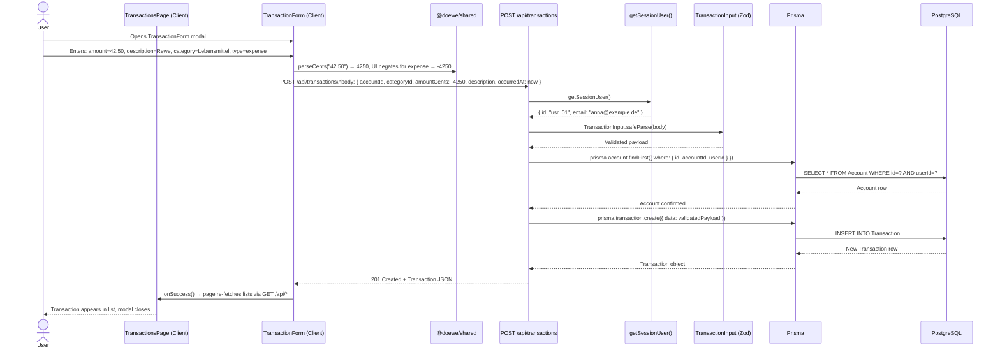
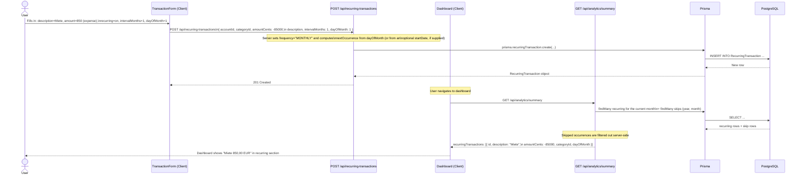
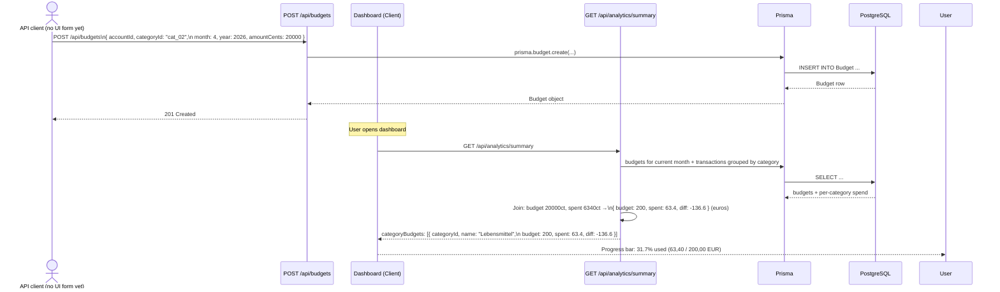
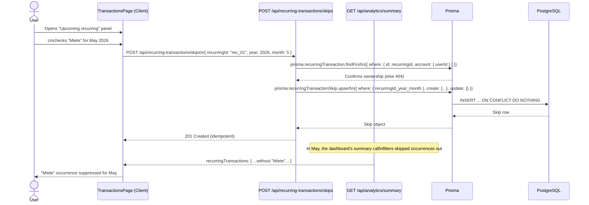
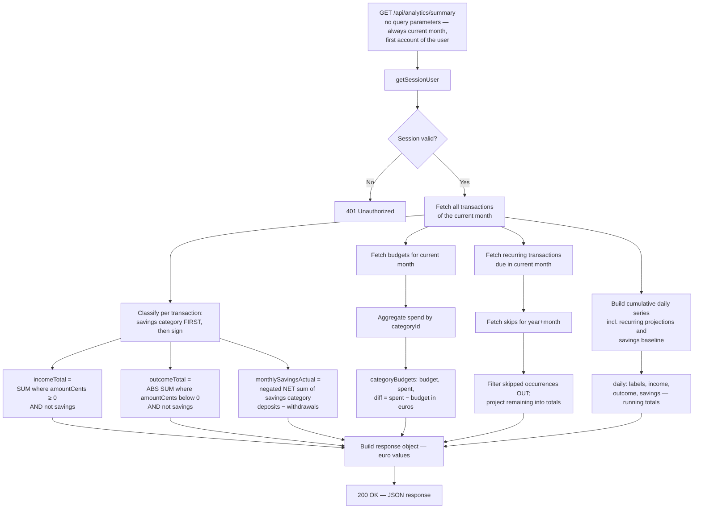
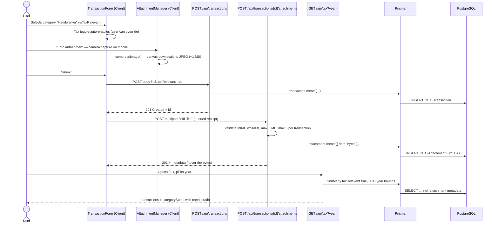

# Doewe — User Flows

This document describes the five core user flows with sequence diagrams and explanatory notes.

---

## Flow 1: Transaction Entry

A user adds a new expense transaction via the transaction form.

```mermaid
sequenceDiagram
    actor User
    participant Page as TransactionsPage (Client)
    participant UI as TransactionForm (Client)
    participant Shared as @doewe/shared
    participant API as POST /api/transactions
    participant Auth as getSessionUser()
    participant Zod as TransactionInput (Zod)
    participant ORM as Prisma
    participant DB as PostgreSQL

    User->>UI: Opens TransactionForm modal
    User->>UI: Enters: amount=42.50, description=Rewe, category=Lebensmittel, type=expense

    UI->>Shared: parseCents("42.50") → 4250, UI negates for expense → -4250
    UI->>API: POST /api/transactions\nbody: { accountId, categoryId, amountCents: -4250, description, occurredAt: now }

    API->>Auth: getSessionUser()
    Auth-->>API: { id: "usr_01", email: "anna@example.de" }

    API->>Zod: TransactionInput.safeParse(body)
    Zod-->>API: Validated payload

    API->>ORM: prisma.account.findFirst({ where: { id: accountId, userId } })
    ORM->>DB: SELECT * FROM Account WHERE id=? AND userId=?
    DB-->>ORM: Account row
    ORM-->>API: Account confirmed

    API->>ORM: prisma.transaction.create({ data: validatedPayload })
    ORM->>DB: INSERT INTO Transaction ...
    DB-->>ORM: New Transaction row
    ORM-->>API: Transaction object

    API-->>UI: 201 Created + Transaction JSON

    UI->>Page: onSuccess() → page re-fetches lists via GET /api/*
    Page-->>User: Transaction appears in list, modal closes
```

The form has an income/expense toggle instead of a signed input: `parseCents` returns the positive cent value and the UI applies the sign (42.50 as expense becomes −4250 cents). There is no date field on creation — `occurredAt` is set to the current timestamp (editing an existing transaction keeps its original date). The auth check happens before any database access — if the session is missing, the request never touches Prisma. After the API returns 201, the form calls its `onSuccess` callback and the transactions page re-fetches its lists via the GET endpoints (the page is a client component; there is no `router.refresh()` / Server-Component cache involved).

---

## Flow 2: Recurring Transaction

A user creates a monthly recurring payment; it then appears in the analytics summary. Creation happens in the **TransactionForm** via its "recurring" toggle (the separate `RecurringTransactionForm` component is edit-only — it PATCHes/DELETEs an existing template).

```mermaid
sequenceDiagram
    actor User
    participant UI as TransactionForm (Client)
    participant API_Create as POST /api/recurring-transactions
    participant Dashboard as Dashboard (Client)
    participant API_Summary as GET /api/analytics/summary
    participant ORM as Prisma
    participant DB as PostgreSQL

    User->>UI: Fills in: description=Miete, amount=850 (expense),\nrecurring=on, intervalMonths=1, dayOfMonth=1
    UI->>API_Create: POST /api/recurring-transactions\n{ accountId, categoryId, amountCents: -85000,\n  description, intervalMonths: 1, dayOfMonth: 1 }
    Note over API_Create: Server sets frequency="MONTHLY" and computes\nnextOccurrence from dayOfMonth (or from an\noptional startDate, if supplied)
    API_Create->>ORM: prisma.recurringTransaction.create(...)
    ORM->>DB: INSERT INTO RecurringTransaction ...
    DB-->>ORM: New row
    ORM-->>API_Create: RecurringTransaction object
    API_Create-->>UI: 201 Created

    Note over Dashboard: User navigates to dashboard

    Dashboard->>API_Summary: GET /api/analytics/summary
    API_Summary->>ORM: findMany recurring for the current month\n+ findMany skips (year, month)
    ORM->>DB: SELECT ...
    DB-->>ORM: recurring rows + skip rows
    Note over API_Summary: Skipped occurrences are filtered out server-side
    API_Summary-->>Dashboard: recurringTransactions: [{ id, description: "Miete",\n  amountCents: -85000, categoryId, dayOfMonth }]
    Dashboard-->>User: Dashboard shows "Miete 850,00 EUR" in recurring section
```

When the recurring transaction is created, the server stores `frequency: "MONTHLY"` and computes `nextOccurrence` from `dayOfMonth` — unless the client supplies an optional `startDate` (`yyyy-mm-dd`), in which case that date becomes the first occurrence (useful when a subscription's first charge is months away). The actual cadence is controlled by `intervalMonths` (e.g., `3` = quarterly). The summary endpoint has no query parameters — it always evaluates the current calendar month. Occurrences the user skipped for the month are **removed** from `recurringTransactions` server-side (there is no `skipped` flag in the response); projected income/outcome totals include only the active occurrences.

---

## Flow 3: Budget Tracking

The dashboard renders the budget-vs-actual comparison per category. Note: there is currently **no budget form in the UI** — the `/budgets` page is a redirect stub to `/saving-plan`, and no UI component calls `POST /api/budgets`. Category budgets are created via the API directly; the saving-plan page's `PlannedSavingForm` targets `/api/saving-plan` (saving goals), not `/api/budgets`.

```mermaid
sequenceDiagram
    actor Client as API client (no UI form yet)
    participant API_Budget as POST /api/budgets
    participant Dashboard as Dashboard (Client)
    participant API_Summary as GET /api/analytics/summary
    participant ORM as Prisma
    participant DB as PostgreSQL

    Client->>API_Budget: POST /api/budgets\n{ accountId, categoryId: "cat_02",\n  month: 4, year: 2026, amountCents: 20000 }
    API_Budget->>ORM: prisma.budget.create(...)
    ORM->>DB: INSERT INTO Budget ...
    DB-->>ORM: Budget row
    ORM-->>API_Budget: Budget object
    API_Budget-->>Client: 201 Created

    Note over Dashboard: User opens dashboard

    Dashboard->>API_Summary: GET /api/analytics/summary
    API_Summary->>ORM: budgets for current month + transactions grouped by category
    ORM->>DB: SELECT ...
    DB-->>ORM: budgets + per-category spend
    API_Summary->>API_Summary: Join: budget 20000ct, spent 6340ct →\n{ budget: 200, spent: 63.4, diff: -136.6 } (euros)
    API_Summary-->>Dashboard: categoryBudgets: [{ categoryId, name: "Lebensmittel",\n  budget: 200, spent: 63.4, diff: -136.6 }]

    Dashboard-->>User: Progress bar: 31.7% used (63,40 / 200,00 EUR)
```

`POST /api/budgets` accepts `{ accountId, categoryId?, month, year, amountCents }` (no `title` field). The analytics endpoint fetches both the budgets and the per-category transaction aggregation for the current month and joins them in application code. The response field is `categoryBudgets`, with **euro** values (already divided by 100) and `diff = spent − budget` — positive `diff` means over budget. The dashboard renders a progress bar per budget line ("63,40 € / 200,00 €").

---

## Flow 4: Skip a Recurring Transaction

A user skips next month's rent payment (e.g., because prepaid). The skip UI lives on the **Transactions page**: an expandable "Upcoming recurring" panel lists each template's occurrence for the **following month** with a checkbox.

```mermaid
sequenceDiagram
    actor User
    participant TxPage as TransactionsPage (Client)
    participant API_Skip as POST /api/recurring-transactions/skips
    participant API_Summary as GET /api/analytics/summary
    participant ORM as Prisma
    participant DB as PostgreSQL

    User->>TxPage: Opens "Upcoming recurring" panel
    User->>TxPage: Unchecks "Miete" for May 2026

    TxPage->>API_Skip: POST /api/recurring-transactions/skips\n{ recurringId: "rec_01", year: 2026, month: 5 }
    API_Skip->>ORM: prisma.recurringTransaction.findFirst\n({ where: { id: recurringId, account: { userId } } })
    ORM-->>API_Skip: Confirms ownership (else 404)

    API_Skip->>ORM: prisma.recurringTransactionSkip.upsert\n({ where: { recurringId_year_month }, create: {...}, update: {} })
    ORM->>DB: INSERT ... ON CONFLICT DO NOTHING
    DB-->>ORM: Skip row
    ORM-->>API_Skip: Skip object
    API_Skip-->>TxPage: 201 Created (idempotent)

    Note over API_Summary: In May, the dashboard's summary call\nfilters skipped occurrences out
    API_Summary-->>TxPage: recurringTransactions: [ ...without "Miete"... ]
    TxPage-->>User: "Miete" occurrence suppressed for May
```

Creating a skip does not delete the `RecurringTransaction` — the template stays intact for future months. The route uses an **upsert**, so skipping an already-skipped month is a no-op that still returns `201` (the unique constraint on `(recurringId, year, month)` backs this). To un-skip, the client sends `DELETE /api/recurring-transactions/skips` with the same body — the skip record is removed (`204`, even if none existed) and the occurrence reappears in the next summary response. Skipped occurrences are filtered out of `recurringTransactions` server-side; the UI reads the skip state for the panel from `GET /api/recurring-transactions/skips?year=…&month=…`.

---

## Flow 5: Monthly Analytics — How the Dashboard Is Built

The dashboard fires **three parallel requests** (`Promise.all`): `GET /api/analytics/summary` (current-month numbers), `GET /api/analytics/quarterly` (3-month view with month-over-month deltas), and `GET /api/saving-plan` (savings suggestions). The summary endpoint assembles the bulk of the dashboard numbers:

```mermaid
flowchart TD
    A[GET /api/analytics/summary\nno query parameters — always current month,\nfirst account of the user] --> B[getSessionUser]
    B --> C{Session valid?}
    C -- No --> ERR[401 Unauthorized]
    C -- Yes --> D[Fetch all transactions\nof the current month]

    D --> E[Classify per transaction:\nsavings category FIRST, then sign]
    E --> F[incomeTotal =\nSUM where amountCents ≥ 0\nAND not savings]
    E --> G[outcomeTotal =\nABS SUM where amountCents below 0\nAND not savings]
    E --> H[monthlySavingsActual =\nnegated NET sum of savings category\ndeposits − withdrawals]

    D --> I[Fetch budgets for current month]
    I --> J[Aggregate spend by categoryId]
    J --> K[categoryBudgets: budget, spent,\ndiff = spent − budget in euros]

    D --> L[Fetch recurring transactions\ndue in current month]
    L --> M[Fetch skips for year+month]
    M --> N[Filter skipped occurrences OUT;\nproject remaining into totals]

    D --> O[Build cumulative daily series\nincl. recurring projections and\nsavings baseline]
    O --> P[daily: labels, income,\noutcome, savings — running totals]

    F --> RESP[Build response object — euro values]
    G --> RESP
    H --> RESP
    K --> RESP
    N --> RESP
    P --> RESP

    RESP --> Q[200 OK — JSON response]
```

The endpoint runs its Prisma queries and performs all aggregation and joining in TypeScript application code — there is no single SQL query that computes everything. Classification happens per transaction with the **savings check first**: a transaction in the savings category counts toward net savings regardless of sign (a withdrawal reduces savings rather than counting as income). Only then are the remaining transactions split by sign into income and expenses. The `daily` object contains **cumulative running totals** per calendar day (including recurring projections and the savings baseline), so the client can render the month chart without additional processing. All monetary values in the response are euros (divided by 100) except `recurringTransactions[].amountCents`.

For reviewing **completed past months**, the `/review` page calls `GET /api/analytics/monthly-review?month=…&year=…` instead — a separate endpoint returning cent values with expense-by-category and income-by-source breakdowns (see the API reference).

---

## Flow 6: Tax Preparation (Steuervorbereitung)

A user earmarks a transaction for the German tax return, attaches a receipt photo, and later reviews the tax year on `/tax`. Receipts follow the **Belegvorhaltepflicht**: they are archived for the Finanzamt on request, not submitted.

```mermaid
sequenceDiagram
    actor User
    participant UI as TransactionForm (Client)
    participant AM as AttachmentManager (Client)
    participant TxAPI as POST /api/transactions
    participant UpAPI as POST /api/transactions/[id]/attachments
    participant TaxAPI as GET /api/tax?year=
    participant ORM as Prisma
    participant DB as PostgreSQL

    User->>UI: Selects category "Handwerker" (isTaxRelevant)
    UI->>UI: Tax toggle auto-enables (user can override)
    User->>AM: "Foto aufnehmen" — camera capture on mobile
    AM->>AM: compressImage() — canvas downscale to JPEG (~1 MB)
    User->>UI: Submit

    UI->>TxAPI: POST body incl. taxRelevant true
    TxAPI->>ORM: transaction.create(...)
    ORM->>DB: INSERT INTO Transaction ...
    TxAPI-->>UI: 201 Created + id

    UI->>UpAPI: POST multipart field "file" (queued receipt)
    UpAPI->>UpAPI: Validate MIME whitelist, max 5 MB, max 5 per transaction
    UpAPI->>ORM: attachment.create({ data: bytes })
    ORM->>DB: INSERT INTO Attachment (BYTEA)
    UpAPI-->>UI: 201 + metadata (never the bytes)

    User->>TaxAPI: Opens /tax, picks year
    TaxAPI->>ORM: findMany taxRelevant true, UTC year bounds
    ORM->>DB: SELECT ... incl. attachment metadata
    TaxAPI-->>User: transactions + categorySums with receipt ratio
```

Key rules: the tax toggle only ever auto-**enables** (never silently disables) and respects a manual override. Marking a **category** as tax-relevant (Settings) retroactively earmarks all of its existing transactions and becomes the server-side default for new ones — an explicit `taxRelevant: false` on a single transaction always wins. Receipt bytes live in the `Attachment.data` BYTEA column and are only ever selected by the binary download endpoint `GET /api/attachments/[id]` — every list endpoint returns metadata only. Deleting a transaction cascades to its receipts. If a receipt upload fails after the transaction was created, the transaction is kept and the form shows a warning so the user can re-attach the file via edit.
